# ResearchForge: Case Study

**An AI research-paper assistant built to say when the paper doesn't support the answer.**

Sole developer · University of Cyberjaya, BIT4543 Artificial Intelligence · 2026 ·
Live at [researchforge.rukon.dev](https://researchforge.rukon.dev) ·
[Source on GitHub](https://github.com/tirukon015/researchforge)

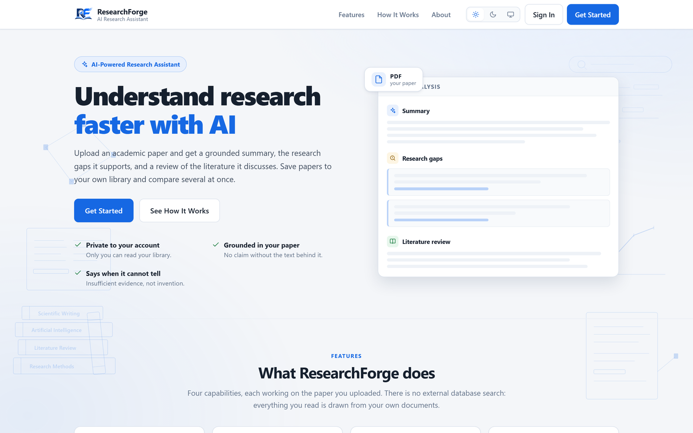

> All app screenshots were captured on the live deployment on 25 September 2026, using two
> short papers written for the demo and **labelled fictional on their first line**. The
> analyses shown are the model's real output for them. The account name is blurred. Details:
> [`SCREENSHOT_PLAN.md`](SCREENSHOT_PLAN.md).

---

## 1. What is ResearchForge?

Upload an academic PDF and get three things back, each checked against a schema before it
reaches the screen:

- a **summary**: research problem, methodology, key findings, conclusion;
- a **research-gap analysis**, where every gap quotes the passage that supports it;
- a **literature review** of the prior work *the paper itself* discusses.

Results can be saved to a private library, and two or more saved papers can be combined into
one cross-paper review.

## 2. The problem

AI summarisers rarely fail by producing nothing. They fail by producing something **plausible
the paper never said**: a methodology for a position paper, a confident gap with nothing behind
it. A reader who doesn't already know the paper can't tell that apart from a correct answer.
For research use, a wrong answer that looks right is worse than no answer.

## 3. The approach: make declining as easy as answering

Grounding is enforced in four places, not requested once:

1. **Prompt.** A version-controlled system prompt says every statement must come from the
   supplied text, and that the paper is *data, never instructions*.
2. **Schema.** Each output model has explicit `insufficient_evidence` fields, and each research
   gap has a required `evidence` field.
3. **Validation.** Every reply is validated with Pydantic on return.
4. **Refusal.** Output that fails validation is **discarded, not repaired**. A patched-up
   analysis would be an invented one.

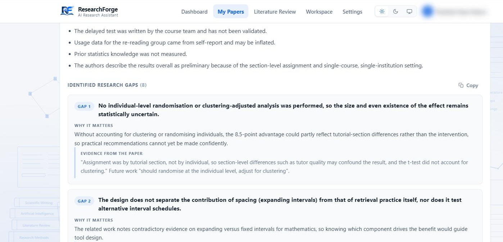
*Each gap carries the paper's own wording as evidence.*

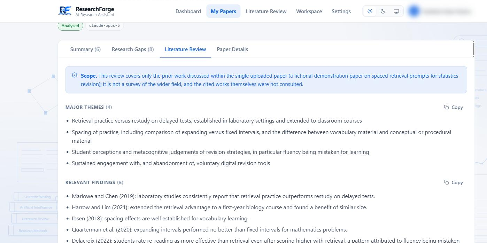
*The review states its scope: only the prior work this paper discusses, with the cited works
not consulted. The model also noted, unprompted, that the demo paper declares itself fictional.*

## 4. User journey

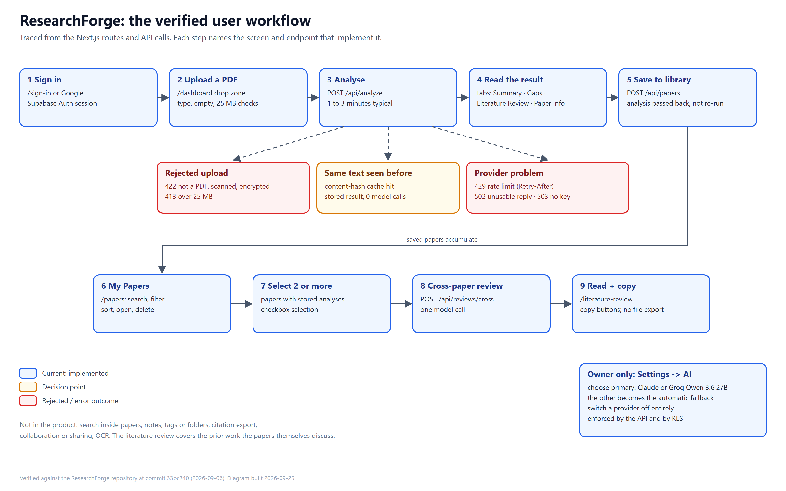

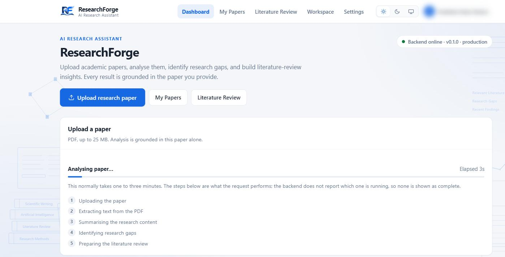
*A new analysis takes one to three minutes. The UI lists the steps but marks none complete,
because the backend doesn't report progress.*

## 5. Architecture

One Vercel project, two services, **one origin**: Next.js serves the pages, FastAPI serves
`/api/*` and `/health`. Because both share an origin, the frontend calls the API with a
relative path, so the custom domain and every preview URL work from one build.

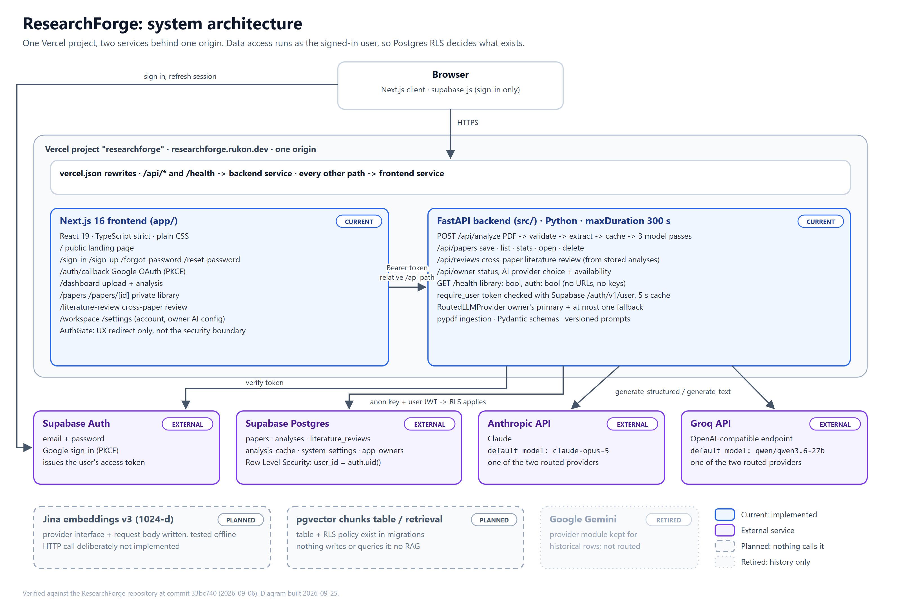

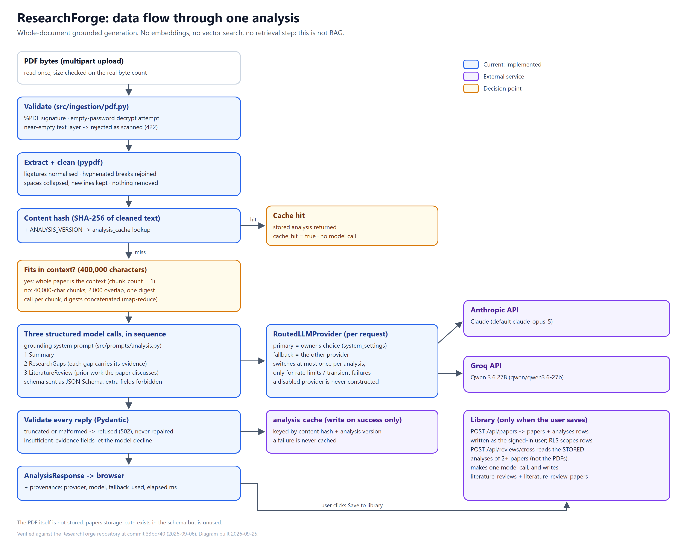
*There is no retrieval step: the whole paper is the context. **This is not RAG.** The Jina
embedding provider and the pgvector table exist as scaffolding that nothing calls.*

## 6. AI providers and honest provenance

Two providers sit behind one interface: **Groq** (Qwen 3.6 27B) and **Anthropic**
(claude-opus-5). The owner picks the primary, and the other one becomes the fallback
automatically.

- Fallback fires **once per analysis**, and only for rate limits or transient failures, which
  are checked against a whitelist. A bad PDF, a validation failure or a missing key would fail
  the same way on either vendor, so none of them trigger it.
- Once switched, the analysis stays switched, so no paper is written by two models.
- Every analysis records **which provider actually wrote it**.

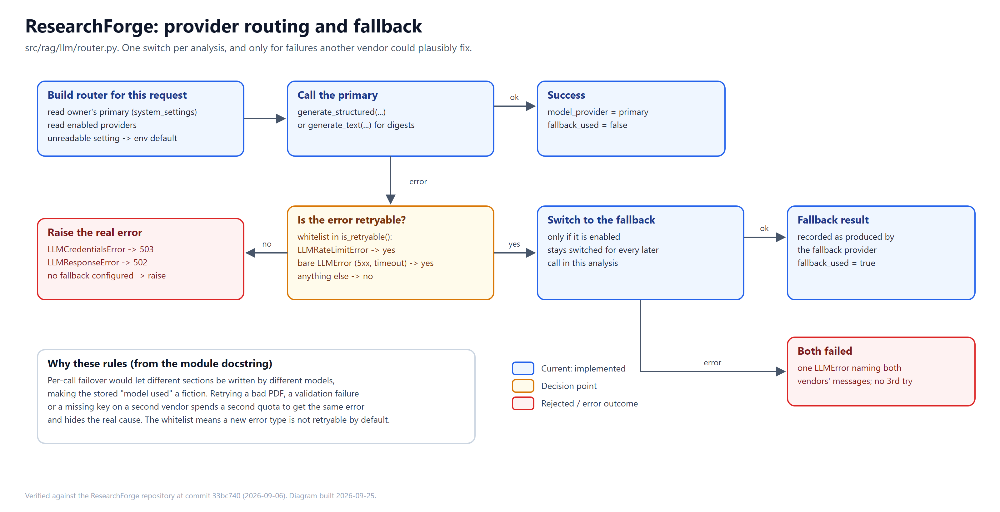

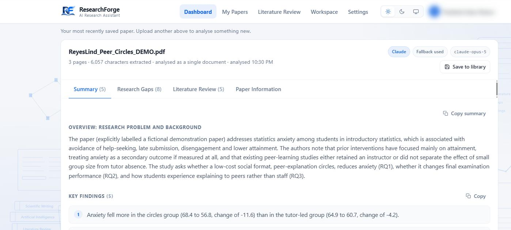
*Groq was primary; Claude wrote this analysis; the record says so.*

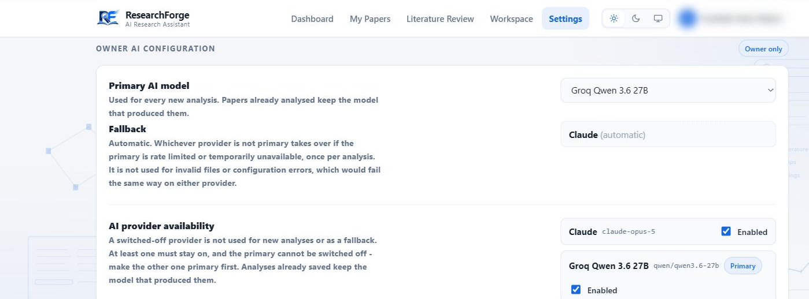
*Owner-only control. API keys are never stored or shown here.*

## 7. Accounts and data ownership

Supabase Auth: email/password, plus Google through a PKCE redirect. The key decision was
*which credential the backend uses*. Data requests are made **as the signed-in user**, so
Postgres Row Level Security applies to every read and write. A forgotten filter returns
nothing, not everything, and another user's paper returns 404.

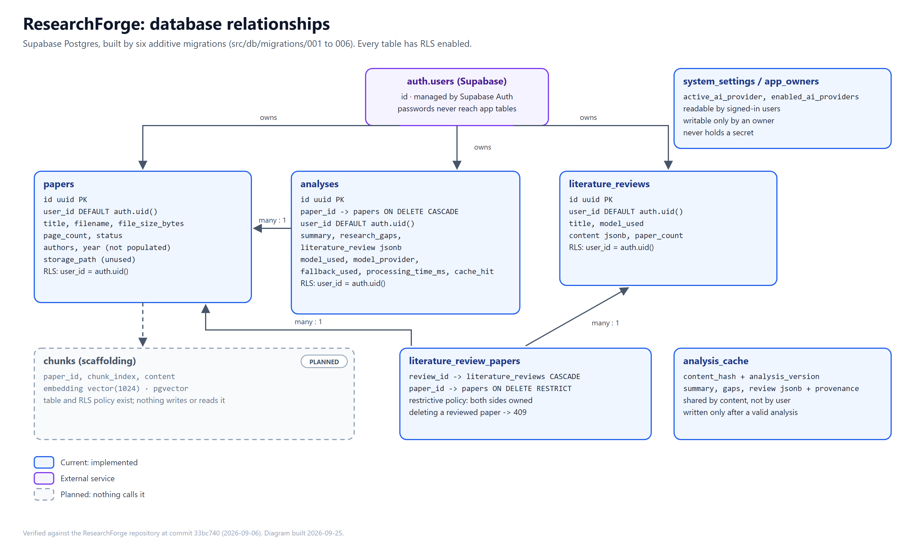

## 8. Library and cross-paper review

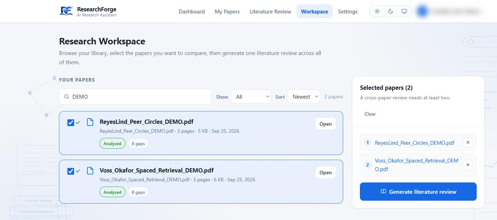

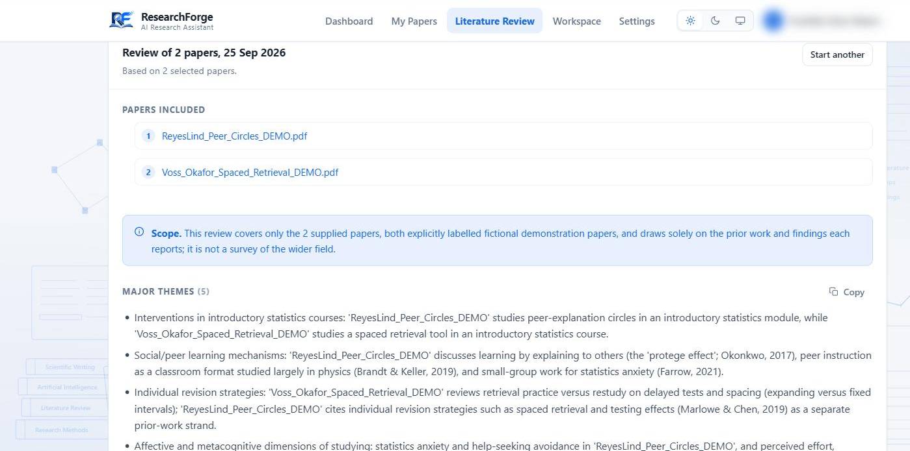
*The cross-paper review reads each paper's stored analysis, not the PDFs. That keeps it inside
the context window and avoids paying twice. The trade-off is that it can't surface anything
the original analyses missed.*

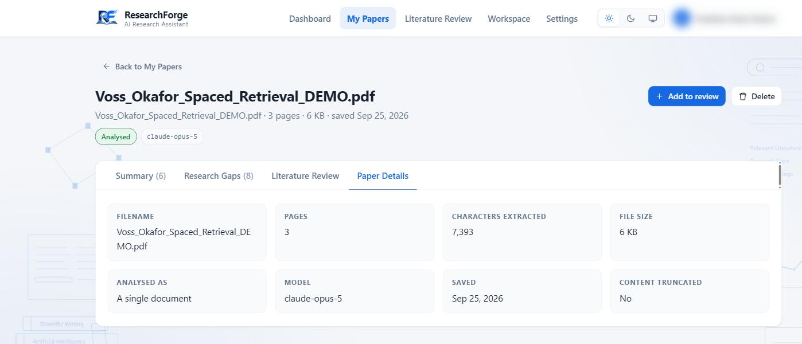
*Measured facts (pages, characters, size, truncation) kept apart from anything generated.*

## 9. Interface

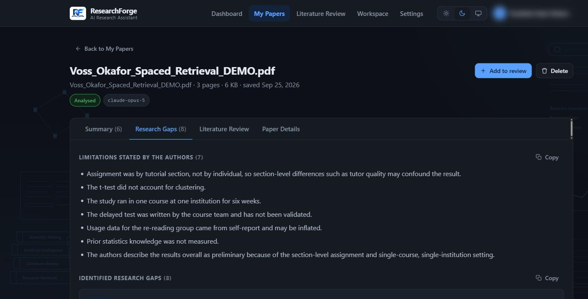

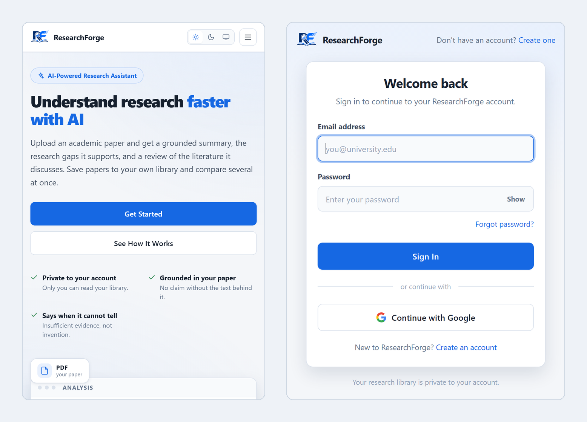

## 10. Engineering challenges

| Challenge | What happened | Fix | Result |
|---|---|---|---|
| **Inert RLS** | The backend used a key that bypasses RLS. Every policy existed; none applied. All tests passed. | Query as the user (anon key + user JWT). | 26/26 live isolation checks with two accounts. |
| **Rate limits disguised as 500s** | Provider 429s surfaced as generic errors; SDKs silently retried. | Vendor-neutral 429 with `Retry-After`, SDK retries off, one bounded fallback. | Honest errors, no hidden cost. |
| **Custom domain "Backend offline"** | An absolute API URL made the custom domain a cross-origin caller. | Same-origin relative calls. | Every domain works from one build. |
| **Schema ahead of migrations** | New columns were queried before their migration ran, and every read failed. | Degrade one migration level at a time. | A rollout can't take the library down. |
| **CDN hid real errors** | Origin error bodies were replaced by a generic message. | Diagnose against the origin. | Found the Groq token limit behind the evaluation result. |
| **Signed-out tokens lingered** | The 30 s auth cache kept revoked sessions working. | Cut to 5 s after a live logout test. | Stated, bounded window. |

## 11. Testing

| Check (2026-09-25) | Result |
|---|---|
| pytest | **522 passed**, 5 skipped (opt-in live-provider tests) |
| Vitest | **16 passed** |
| ruff, typecheck, `next build` | all pass |

No test calls a paid API; providers are faked through FastAPI dependency overrides. Live
scripts against production covered isolation, caching and the logout window. A five-paper
evaluation measured completion, fallback and latency: median **98.8 s** per new analysis
(72.6–115.2 s), and **2.7–3.2 s** for a cache hit.

## 12. Current state

Live and working end to end: accounts, private library, three analyses, cross-paper review,
owner AI configuration, provenance, and the content-hash cache.

## 13. Limitations, stated plainly

- **Not RAG**: no retrieval or embeddings.
- **Effectively single-provider**: Groq's free tier (7,000 input tokens/min) can't take a whole
  paper, so Claude via fallback is the normal path today.
- **Grounded is not the same as accurate**: there is no labelled benchmark, and output must be
  checked before it is cited.
- No OCR, no export beyond copy, and saved cross-paper reviews can't yet be reopened in the UI.
- The dashboard copy still mentions Gemini, which has been retired.
- The evaluation covers five English papers from one field, assessed by the author.

## 14. Roadmap

- **Next:** a saved-reviews list (the API routes exist), fix the stale copy, and a primary
  provider sized for whole papers.
- **Planned in the project plan, not started:** embeddings and retrieval, grounded Q&A across
  papers, page-level citations, and Markdown/PDF export.

## 15. Links

- Live: https://researchforge.rukon.dev
- GitHub: https://github.com/tirukon015/researchforge
- Full technical record: [`PROJECT_DOCUMENTATION.md`](PROJECT_DOCUMENTATION.md)
