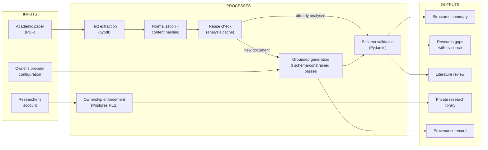
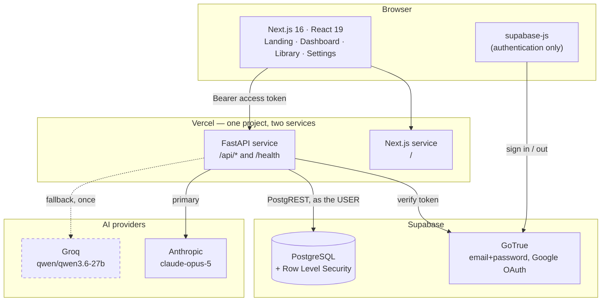
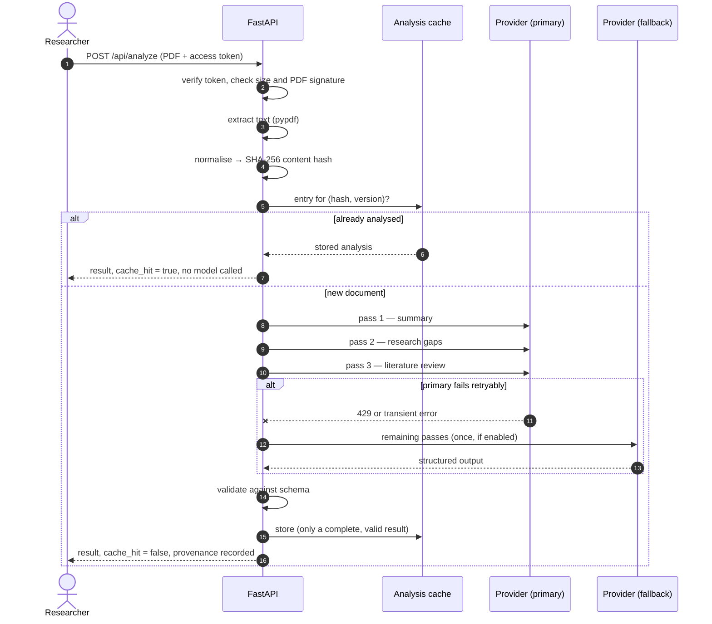
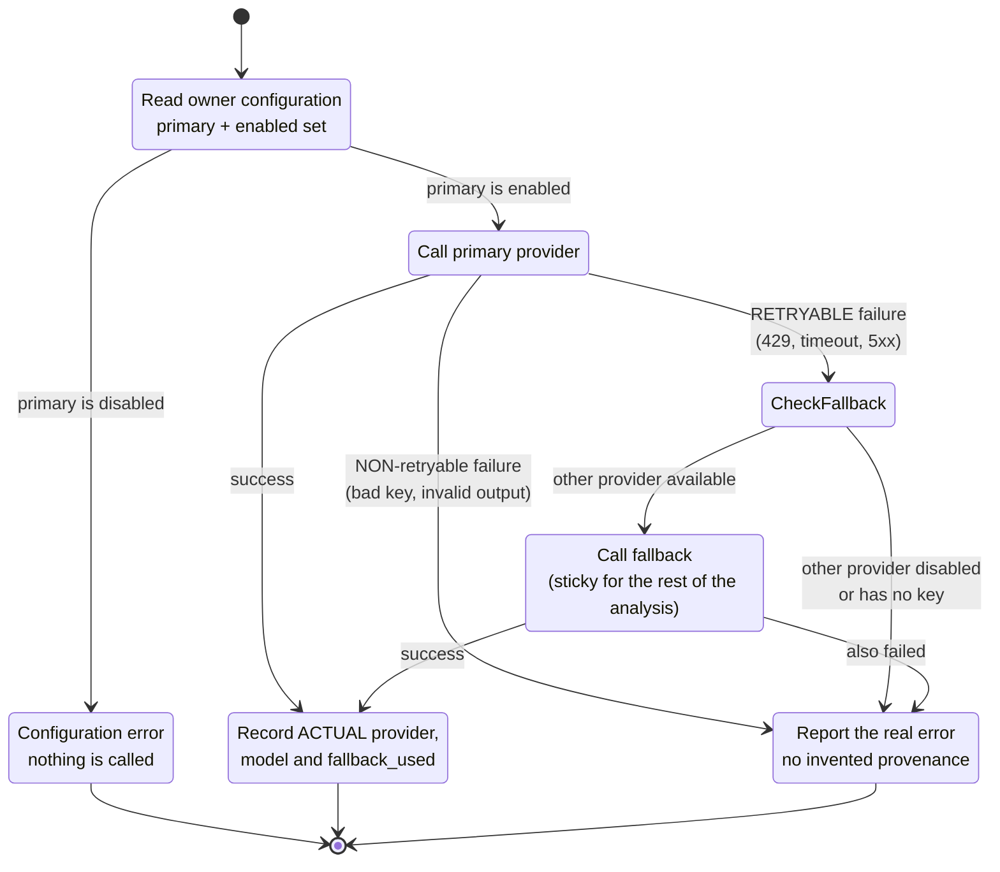
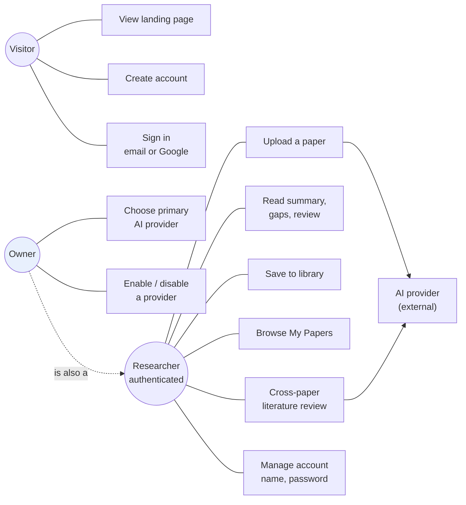
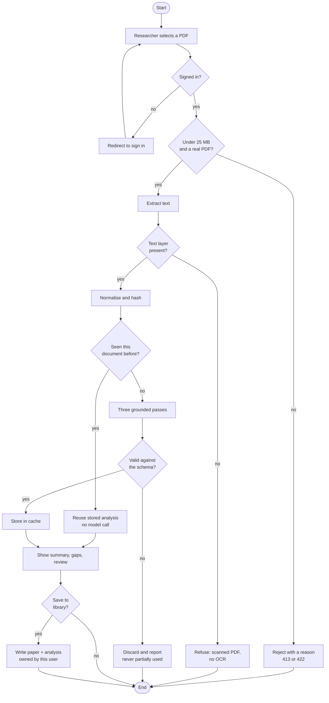
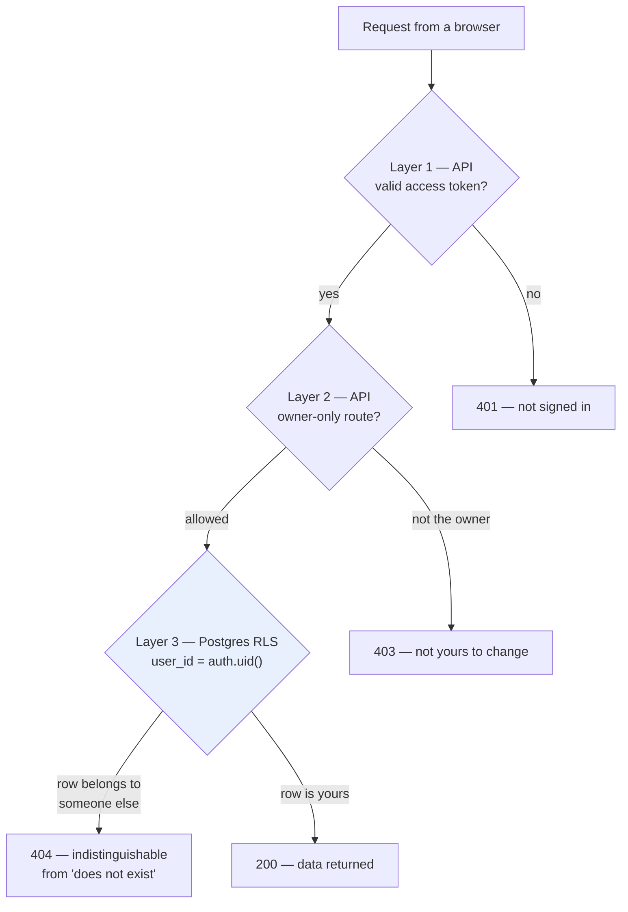

# Diagrams

Every diagram below describes the system **as it is built**, not as it was
planned. Each is followed by the explanation the report needs beside it.

They are written in Mermaid so they live in version control as text, stay
readable in a diff, and can be exported to images for the report and slides
(mermaid.live, or the Mermaid extension in VS Code).

---

## Figure 2.1 — Conceptual framework

*Chapter 2.4. Inputs, processes, outputs.*



**Reading it.** The single most important feature is the branch at `B3`. A
document that has been analysed before does not reach the model at all, which
is what makes the same paper cost one analysis rather than one per user. The
second is that `B6` sits on the path to the library and nothing else: the
analysis is shared, the library is not.

---

## Figure 3.1 — System architecture

*Chapter 3.2.*



**Reading it.** Two things are deliberate and worth stating in the report.

The browser talks to Supabase **only** to sign in; it never reads or writes
research data. Everything else goes through FastAPI, so validation, grounding
rules and the error vocabulary live in one place.

The backend reaches Postgres **as the signed-in user**, passing that user's own
access token rather than a service key. This is what makes ownership a property
of the database rather than of a `WHERE` clause the application has to
remember. The one exception is the analysis cache, which holds no user data and
is reachable only by the server (see Figure 4.3).

---

## Figure 3.2 — Analysis pipeline

*Chapter 3.5. What happens between an upload and a result.*



**Reading it.** The three passes are deliberately separate calls rather than
one. Each is constrained to its own schema, so a malformed summary cannot
corrupt the gap analysis, and a failure is attributable to one section.

The `alt` branch is the fallback rule: it fires only for *retryable* failures,
at most once per analysis, and the router stays switched afterwards so one
analysis is never written by two different models.

---

## Figure 3.3 — Provider routing and fallback

*Chapter 3.5.*



**Reading it.** Two rules stop this being merely convenient. Falling back only
on retryable failures means a bad API key or an unusable response is not
retried on a second vendor to produce the same error at twice the cost. Staying
switched means the analysis is finished by one model, so the recorded
provenance is true.

---

## Figure 4.1 — Use case diagram

*Chapter 4.2.*



**Reading it.** The owner is a researcher with two extra capabilities, not a
separate kind of user — which is why there is no separate owner login. UC10 and
UC11 are the only actions any other account is refused.

---

## Figure 4.2 — Activity diagram: upload to saved analysis

*Chapter 4.3.*



**Reading it.** Three separate refusal paths — oversized file, no text layer,
invalid model output — are shown deliberately. Each fails with its own message
rather than a generic error, and none produces a partial result.

---

## Figure 4.3 — Entity relationship diagram

*Chapter 4.4.*

```mermaid
erDiagram
    AUTH_USERS ||--o{ PAPERS : owns
    AUTH_USERS ||--o{ ANALYSES : owns
    AUTH_USERS ||--o{ LITERATURE_REVIEWS : owns
    AUTH_USERS ||--o| APP_OWNERS : "may be"
    PAPERS ||--o{ ANALYSES : "is analysed by"
    PAPERS ||--o{ CHUNKS : "is split into"
    LITERATURE_REVIEWS ||--|{ LITERATURE_REVIEW_PAPERS : "is built from"
    PAPERS ||--o{ LITERATURE_REVIEW_PAPERS : "contributes to"

    AUTH_USERS {
        uuid id PK
        text email
        jsonb user_metadata
    }
    PAPERS {
        uuid id PK
        uuid user_id FK "DEFAULT auth.uid()"
        text title
        text filename
        int page_count
        int extracted_characters
        text status
    }
    ANALYSES {
        uuid id PK
        uuid paper_id FK
        uuid user_id FK "denormalised owner"
        jsonb summary
        jsonb research_gaps
        jsonb literature_review
        text model_used
        text model_provider
        bool fallback_used
        int processing_time_ms
        bool cache_hit
    }
    LITERATURE_REVIEWS {
        uuid id PK
        uuid user_id FK
        text title
        jsonb content
        int paper_count
    }
    LITERATURE_REVIEW_PAPERS {
        uuid review_id PK_FK
        uuid paper_id PK_FK
        int position
    }
    CHUNKS {
        uuid id PK
        uuid paper_id FK
        vector embedding "scaffolding, unused"
    }
    APP_OWNERS {
        uuid user_id PK_FK
        timestamptz granted_at
    }
    SYSTEM_SETTINGS {
        text key PK
        text value
        uuid updated_by FK
    }
    ANALYSIS_CACHE {
        uuid id PK
        text content_hash UK
        text analysis_version UK
        jsonb summary
        jsonb research_gaps
        jsonb literature_review
        text model_used
        int hit_count
    }
```

**Reading it.** Two features of this diagram carry most of the design.

`ANALYSIS_CACHE` has **no relationship to any user table**, and that is the
privacy guarantee rather than an omission. It is keyed by document content, so
two researchers uploading the same paper share one analysis while their library
records stay entirely separate. Adding a `user_id` here would turn the table
into an answer to "who has read what".

`CHUNKS` exists but is **unused**. It was built for a retrieval pipeline that
was not implemented; the production path reads whole documents. It is shown
here because it is in the schema, and labelled so the report does not imply a
capability the system lacks.

---

## Figure 4.4 — Authorisation layers

*Chapter 4.1, non-functional requirements: security.*



**Reading it.** Layer 3 is the one that matters, and it is highlighted for that
reason. Layers 1 and 2 are application code and could contain a bug; layer 3 is
enforced by the database on every query, so a forgotten filter returns *nothing*
rather than everything.

The 404 at layer 3 is deliberate. Answering 403 for "exists but is not yours"
would turn the identifier in a URL into a way to confirm which papers other
people hold.
