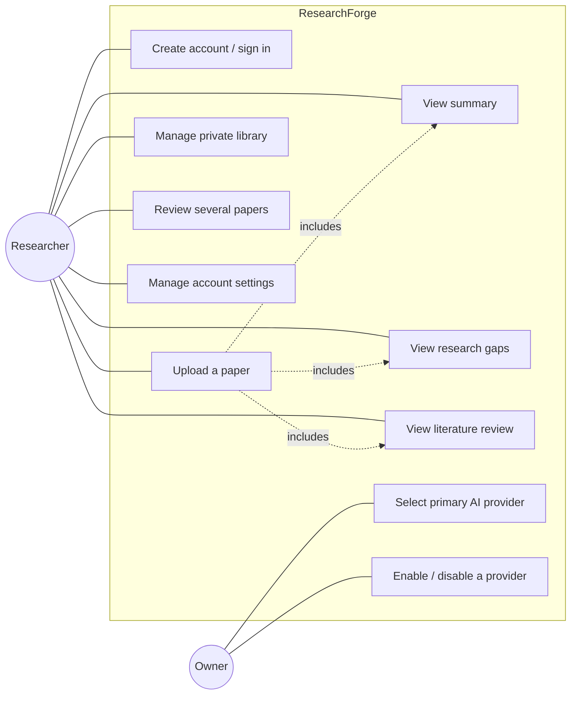
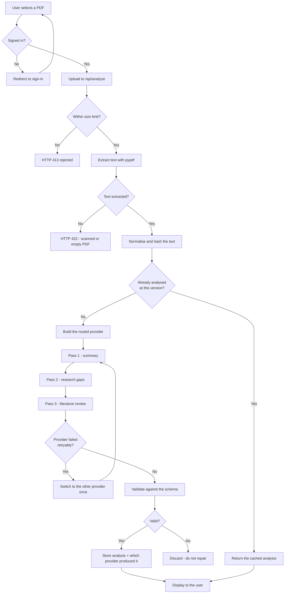
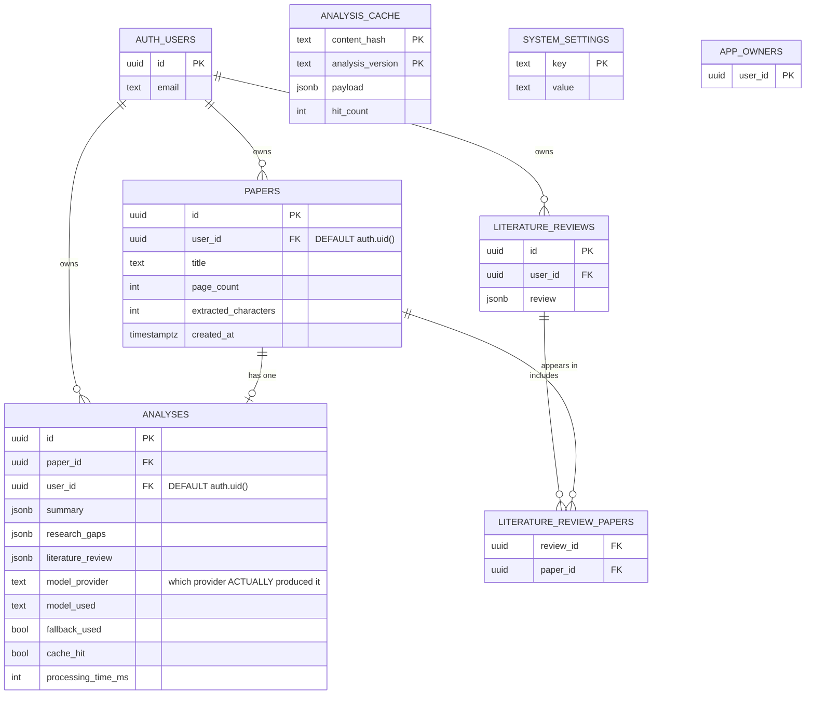
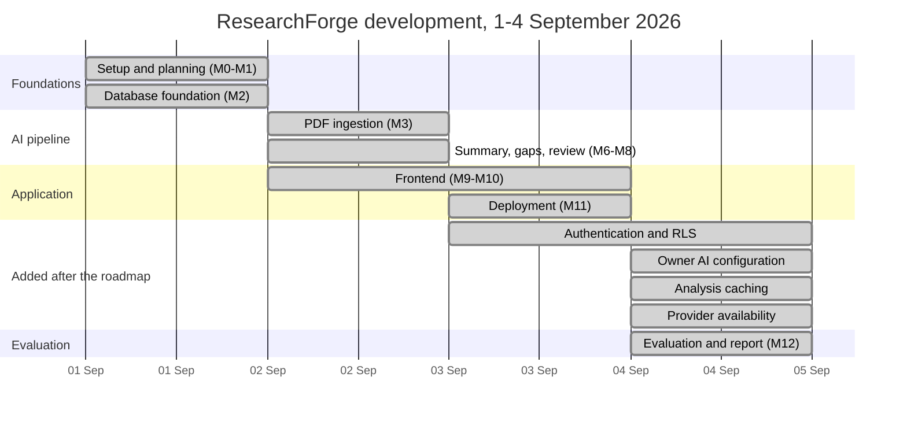

# ResearchForge: An AI Research Paper Assistant

**BIT 4543 — Artificial Intelligence**

| | |
|---|---|
| **Project title** | ResearchForge: An AI-Powered Research Paper Assistant |
| **Course code and name** | BIT 4543 — Artificial Intelligence |
| **Group members** | `[GROUP MEMBER 1 — FULL NAME & STUDENT ID]`<br/>`[GROUP MEMBER 2 — FULL NAME & STUDENT ID]`<br/>`[GROUP MEMBER 3 — FULL NAME & STUDENT ID]` |
| **Lecturer** | Azuan Nazeer |
| **Submission date** | `[SUBMISSION DATE]` |
| **Live system** | https://researchforge.rukon.dev |
| **Repository** | https://github.com/tirukon015/researchforge |

> **Four fields above are placeholders.** Group member names and student IDs,
> and the submission date, must be filled in before submission. Everything else
> in this report is complete.

---

## Declaration

This report describes work carried out by the group named above for BIT 4543.
The software described is our own; the third-party components it depends on
(Next.js, FastAPI, Supabase, the Anthropic and Groq APIs) are named where they
are used. The research papers used to evaluate the system are the published
work of their own authors, cited in the References, and were used only as
input documents.

Every measurement reported in Chapter 5 was produced by running the deployed
system. No result has been estimated, adjusted, or reproduced from memory. Where
something was not measured, the report says so rather than supplying a figure.

---

## Executive Summary

Researchers spend a substantial share of their time reading papers in order to
decide which papers are worth reading. ResearchForge is a deployed web
application that reduces that first pass: a user uploads a PDF and receives
three structured outputs — a summary, an analysis of the research gaps the
paper supports, and a literature review of the prior work it discusses — each
saved to a private library.

The AI component is **inference** against hosted large language models, not a
model trained by this project. Two providers sit behind one interface:
Anthropic Claude (`claude-opus-5`) and Groq (`qwen/qwen3.6-27b`). Output is
constrained to a declared schema and validated before display; where a paper
does not support a section, the system reports *insufficient evidence* rather
than generating plausible text. The architecture is whole-document grounded
generation, **not** retrieval-augmented generation.

The system was evaluated on five open-access arXiv papers through the
production deployment, in three passes totalling fifteen runs, of which ten
produced complete analyses. The principal finding is a negative one: the
intended Claude-versus-Groq comparison **could not be completed**, because
Groq's free tier permits 7,000 input tokens per minute while every paper tested
required between 7,920 and 20,362 in a single request. Groq produced nothing,
yet every paper was analysed successfully because the fallback silently handed
each one to Claude — demonstrating that a redundancy mechanism conceals the
failure it compensates for.

Data isolation was verified against the live database with two accounts (26
checks, no failures), and a content-addressed cache reduced a repeat analysis
from 32.4 seconds to 3.2.

---

# Chapter 1: Introduction

## 1.1 Background

Academic publishing has grown faster than any individual's capacity to read it.
A researcher beginning work in an unfamiliar area faces a search result of
dozens or hundreds of papers, most of which will prove irrelevant, and the only
reliable way to find out is to read them. The cost is concentrated in a
specific place: the *triage* pass, in which a reader establishes what a paper
claims, how it was done, and whether it bears on their question.

This is a task where language models are genuinely well suited, and for a
specific reason. It requires reading comprehension over a single long document
and the production of structured prose — not prediction, not classification,
and not a numerical estimate. It does not require the model to know anything
beyond the document in front of it, which is important: a system that must only
report what a given text says can be constrained and checked far more tightly
than one expected to draw on world knowledge.

The relevant AI capability is therefore not a trained classifier but
instruction-following generation grounded in supplied text. That framing shapes
every design decision in this project, and it is why the evaluation in Chapter 5
measures groundedness and completeness rather than accuracy against a label.

## 1.2 Problem Statement

Reading a research paper well enough to decide whether to read it properly is
slow, repetitive, and does not benefit from being done by hand. Three specific
difficulties follow.

**The triage cost is paid per paper and per reader.** Two researchers
independently assessing the same paper duplicate the entire effort. There is no
mechanism by which the second benefits from the first.

**Extracting what a paper leaves open is harder than summarising it.** Research
gaps are stated across a limitations section, a future-work paragraph, and
often only implicitly in a discussion of results. Assembling them is more
demanding than producing an abstract, and it is the part a reader most needs
when deciding whether a paper opens a direction worth pursuing.

**Automated summaries are not trustworthy by default.** A language model asked
to summarise will produce fluent text whether or not the source supports it. For
academic use this is disqualifying: a summary that invents a methodology is
worse than no summary, because it is confidently wrong and the reader has no
signal that anything is amiss.

The problem this project addresses is therefore not "summarise papers" but:
*produce structured, checkable analyses of academic papers that are grounded in
the paper's own text, that state when the text does not support a conclusion,
and that do not repeat work already done.*

## 1.3 Project Objectives

1. **To develop an AI-based system that produces structured summaries, research
   gap analyses, and literature reviews from uploaded academic papers**, with
   every generated claim grounded in the uploaded document.

2. **To enforce grounding structurally rather than by instruction alone**, by
   constraining model output to a declared schema, validating it before display,
   and providing an explicit mechanism by which the system reports insufficient
   evidence instead of generating unsupported content.

3. **To implement a provider-independent AI layer** supporting two
   commercially available language model providers, with owner-controlled
   selection and automatic single-attempt fallback for retryable failures, so
   that the system's availability does not depend on a single vendor.

4. **To guarantee per-user data isolation at the database level**, so that a
   researcher's uploaded papers, analyses, and reviews are readable only by
   them, enforced by Row Level Security rather than by application logic.

5. **To reduce redundant computation** by identifying documents by content
   rather than by filename, so that the same paper is analysed once regardless
   of how many users upload it, without exposing any information about other
   users.

6. **To evaluate the system empirically** against a corpus of real open-access
   research papers under both AI providers, using measurable criteria
   appropriate to a generative task.

## 1.4 Scope of Project

**Included.**

- Upload of academic papers in PDF format, with server-side text extraction.
- Three-pass grounded analysis: summary, research gaps, literature review.
- Cross-paper literature review across several saved papers.
- Authenticated multi-user access: email and password, and Google sign-in.
- A private research library per user, with per-user isolation enforced by the
  database.
- Owner-controlled AI provider configuration: which provider is primary, and
  which providers are permitted at all.
- Content-addressed reuse of analyses across users.
- Deployment to a public production environment.

**Excluded, and deliberately so.**

- **No external literature search.** The system analyses documents the user
  supplies. It does not query arXiv, Scopus, or any bibliographic database. The
  interface states this, because a user expecting a search engine would be
  misled.
- **No retrieval-augmented generation.** The production path reads whole
  documents. The repository contains an embedding provider, a `chunks` table,
  and a pgvector column, none of which are called by the analysis path. This is
  stated explicitly in Section 3.5 and again in Section 6.3.
- **No OCR.** A scanned PDF with no text layer is refused rather than guessed
  at.
- **No model training or fine-tuning.** The system performs inference against
  hosted foundation models. Section 3.5 sets out why, and what that means for
  what this project can and cannot claim.
- **No claim of encryption beyond what the platform provides.** The system does
  not implement its own cryptography, and the interface does not assert that it
  does.

## 1.5 Significance of the Project

For an individual researcher, the system reduces the triage pass on a paper
from a careful read to reviewing a structured analysis, with the gap analysis
in particular assembling material that is otherwise scattered across a
document.

For the wider problem, the project demonstrates three things that generalise
beyond this application.

**Grounding can be enforced structurally.** Instructing a model to avoid
inventing content is unreliable. Constraining it to a schema that contains an
explicit `insufficient_evidence` field, and validating output before display,
converts a request into a check. Section 3.5 and Section 5.3 develop this.

**Provider independence is achievable at low cost.** The entire AI layer sits
behind one interface of two methods. Adding a second vendor was one new file;
switching between them is a configuration value, not a redeployment. For a
student project dependent on free API tiers, this proved to be more than an
architectural nicety — Chapter 5 reports how often the fallback was actually
needed.

**Privacy and efficiency are not necessarily in tension.** The analysis cache
lets two users share the cost of analysing the same paper while sharing nothing
else. The design is examined in Section 4.4, and rests on the cache holding no
user identifier at all.

---

# Chapter 2: Literature Review

## 2.1 Overview of AI Technologies

**Artificial intelligence** in this project means a system that performs a task
normally requiring human reading comprehension. No search, planning, or
optimisation techniques are used; the entire AI component is language
understanding and generation.

**Machine learning** is the paradigm underlying the models used, but not a
technique this project applies directly. The models were trained by their
vendors on large text corpora; this project performs **inference** against
them. The distinction matters for how the work should be assessed: there is no
training set, no validation curve, and no overfitting in this system, because
no model is fitted here. Chapter 5 measures the behaviour of a system built
around a model, not the model itself.

**Deep learning**, specifically the transformer architecture (Vaswani et al.,
2017), is what makes the task feasible. Self-attention allows a model to relate
distant parts of a document, which is exactly what summarising a paper
requires: a claim in the abstract must be reconciled with results in Section 4
and caveats in Section 6.

**Natural language processing** is the applicable subfield. The specific tasks
are abstractive summarisation, information extraction (stated limitations and
future work), and structured generation constrained to a schema. Two related
NLP problems are deliberately *not* solved here: extractive summarisation,
which selects existing sentences, and factual consistency evaluation, which
scores generated text against its source (Wang et al., 2020) — the latter is a
plausible future addition and is discussed in Section 7.2.

## 2.2 Related Works

| Study / System | Method used | Strengths | Limitations |
|---|---|---|---|
| Vaswani et al. (2017), *Attention Is All You Need* | Transformer encoder–decoder built entirely on self-attention | Removed recurrence, enabling parallel training and long-range dependency modelling; the architectural basis of every model used in this project | An architecture, not an application; no document-level analysis task addressed |
| Devlin et al. (2019), *BERT* | Bidirectional pretraining with masked language modelling, then task fine-tuning | Showed general pretraining transfers across NLP tasks; established the pretrain–adapt pattern | Encoder-only, so not generative; requires task-specific fine-tuning and labelled data, neither of which this project has |
| Beltagy et al. (2019), *SciBERT* | BERT pretrained on a scientific corpus | Demonstrated that domain-specific pretraining measurably improves performance on scientific text | Still requires fine-tuning per task; produces representations, not the structured prose a researcher reads |
| Lewis et al. (2020), *Retrieval-Augmented Generation* | Dense retrieval over a passage index, feeding a generator | Grounds generation in retrieved evidence; scales to corpora far larger than a context window | Retrieval quality bounds output quality; adds an index, an embedding model, and a failure mode this project does not need for single-document analysis |
| Wang et al. (2020), *Asking and Answering Questions to Evaluate Factual Consistency* | Generates questions from a summary and answers them against the source | Provides an automatic, reference-free consistency signal — directly relevant to the problem of ungrounded summaries | Requires an additional QA pipeline; evaluates consistency, and does not by itself prevent unsupported generation |
| General-purpose assistants (ChatGPT, Claude.ai and similar) | Conversational access to a hosted LLM | Immediately available; strong summarisation quality | Output is unstructured and unvalidated; no persistence, no per-user library, no schema, no explicit insufficient-evidence signal, and no reuse across users |
| Reference managers (Zotero, Mendeley) | Metadata capture, storage, citation formatting | Excellent at organising a corpus | No content analysis; they store papers, they do not read them |

## 2.3 Research Gap

The related work above leaves a specific space unoccupied.

**Retrieval-based systems solve a problem this task does not have.** RAG exists
because a corpus does not fit in a context window. A single research paper
does: the corpus used in this project ranges from roughly 24,000 to 69,000
characters, comfortably inside the window of any current model. Introducing
retrieval for single-document analysis adds an embedding model, an index, and a
retrieval-quality failure mode without addressing the actual difficulty. This
project therefore deliberately does not use retrieval — and Section 6.3 is
candid that the repository nonetheless contains unused scaffolding for it.

**General assistants produce unstructured, unchecked output.** Asking a
conversational model to summarise a paper works well and offers no guarantee.
The output has no declared shape, is not validated, cannot state that a section
is unsupported in a machine-readable way, and is not stored. Nothing prevents
fluent invention, and nothing signals when it has occurred.

**Nothing in the surveyed work addresses redundancy across users.** Each of the
systems above analyses per request. Two researchers assessing the same paper
pay twice, and the second gains nothing from the first.

**This project addresses all three.** It constrains generation to a declared
schema with an explicit insufficient-evidence mechanism and validates output
before display (Objective 2); it uses whole-document grounding rather than
retrieval, matching the technique to the actual task (Section 3.5); and it
identifies documents by content hash so that an analysis is computed once and
reused, while remaining invisible between users (Objective 5, Section 4.4).

## 2.4 Conceptual Framework

See **Figure 2.1** in `docs/report/DIAGRAMS.md`.

The framework has three stages. **Inputs** are the PDF, the authenticated
identity of the researcher, and the owner's provider configuration.
**Processes** are extraction, normalisation and hashing, a reuse check,
grounded generation, schema validation, and ownership enforcement. **Outputs**
are the three analysis sections, the private library record, and a provenance
record naming the model that actually produced the result.

Two features of the framework carry most of the design. The reuse check sits
*before* generation, so a previously analysed document never reaches a model.
Ownership enforcement sits on the path to the library and nowhere else, which
is what allows the analysis to be shared while the library is not.

---

# Chapter 3: Methodology

## 3.1 Development Methodology

Development followed an **incremental, milestone-based approach**, with each
milestone required to be deployed and verified before the next began. This was
chosen over a phased waterfall for a specific reason: the project's principal
risks — whether extraction would work on real PDFs, whether a model would honour
a schema, whether free API tiers would sustain the workload — could only be
retired by running the system against real inputs, not by specifying it more
carefully.

The milestones were: (1) analysis pipeline and deployment; (2) persistence;
(3) authentication and per-user isolation; (4) the two-provider AI layer with
fallback; (5) the analysis cache; (6) owner-controlled provider availability;
and (7) evaluation.

Two disciplines were applied throughout, and both materially affected the
result.

**Automated testing preceded deployment at every milestone.** The suite reached
522 backend and 16 frontend tests, all of which run offline against fakes with
no API key. This was not merely diligence: it is what allowed a two-provider
architecture with fallback to be developed without spending quota on every
change.

**Verification was performed against the deployed system, not the local one.**
Several defects were found this way and would not have been found otherwise.
Section 5.1 documents them, because they are the most instructive part of the
testing story.

## 3.2 System Architecture

See **Figure 3.1** in `docs/report/DIAGRAMS.md`.

The system is a three-tier web application deployed as a single Vercel project
running two services: a Next.js frontend at `/` and a FastAPI backend at
`/api/*` and `/health`. They share an origin, which removes cross-origin
configuration as a source of failure.

Persistence and authentication are provided by Supabase (PostgreSQL and GoTrue).
The browser communicates with Supabase **only** to authenticate; all research
data flows through the FastAPI backend, keeping validation, grounding rules and
error handling in one place.

The most consequential architectural decision is how the backend reaches the
database. It uses **the signed-in user's own access token**, not a service key.
Postgres therefore evaluates `auth.uid()` as that user and applies Row Level
Security to every query. Ownership becomes a property of the database rather
than of a `WHERE` clause the application must remember. Section 4.1 and Section
5.1 return to this.

## 3.3 Data Collection

Data in this project takes two forms, and conflating them would misrepresent
the work.

**Operational data** is the papers users upload. There is no fixed dataset; the
system processes whatever documents its users provide.

**Evaluation data** is a fixed corpus assembled specifically to measure the
system. It comprises **five open-access papers from arXiv**, listed in
`data/dataset_manifest.csv` with metadata retrieved from the arXiv API rather
than transcribed, and stored in `data/samples/`.

| ID | Title | Year | Pages | Characters |
|---|---|---|---|---|
| 1706.03762 | Attention Is All You Need | 2017 | 15 | 39,489 |
| 1810.04805 | BERT: Pre-training of Deep Bidirectional Transformers for Language Understanding | 2018 | 16 | 63,578 |
| 1903.10676 | SciBERT: A Pretrained Language Model for Scientific Text | 2019 | 6 | 23,767 |
| 2004.04228 | Asking and Answering Questions to Evaluate the Factual Consistency of Summaries | 2020 | 13 | 46,601 |
| 2005.11401 | Retrieval-Augmented Generation for Knowledge-Intensive NLP Tasks | 2020 | 19 | 69,097 |

Selection followed criteria fixed before any paper was chosen: open access and
legitimately redistributable; a genuine text layer; spread across subfields
(architecture, pretraining, domain adaptation, retrieval, evaluation); and a
range of lengths, the longest being nearly three times the shortest. All five
are within the project's own domain, which means their content is one the
authors can assess when scoring groundedness.

Format is PDF; total corpus size is approximately 5.2 MB.

## 3.4 Data Preprocessing

The lecturer's template lists cleaning, missing values, feature engineering and
normalisation. Three of the four apply here in a modified form, and the report
states plainly which do not.

**Extraction.** `pypdf` extracts the text layer. A PDF with no text layer — a
scan — yields nothing usable and is **refused**, not guessed at. This is a
correctness decision: an analysis of an empty extraction would be pure
invention.

**Cleaning and normalisation.** Extracted text is normalised for hashing:
Unicode is folded to NFKC, whitespace runs collapse to a single space, and
leading and trailing whitespace is removed. The normalisation is deliberately
**conservative**. It does *not* lowercase, strip punctuation, remove numbers, or
drop stop words, because the two error directions are not symmetric: a missed
match costs one redundant analysis, whereas a false match would show a
researcher an analysis of a paper they did not upload. Section 4.4 develops
this.

**Missing values** do not arise in the conventional sense — there is no tabular
data with absent cells. The analogous problem is a *section a paper does not
support*, and it is handled explicitly rather than imputed: the response schema
carries `insufficient_evidence` fields, and the system reports them instead of
generating content.

**Feature engineering does not apply.** No features are constructed, because no
model is fitted. The text is passed to the model as text. Saying otherwise
would misdescribe the system.

**Long-document handling.** Documents exceeding 400,000 characters are digested
section by section before analysis. No paper in the evaluation corpus reached
this threshold — all five were analysed whole, in a single pass, as Chapter 5
reports.

## 3.5 AI Model Development

### Selection

Two providers are implemented behind a single interface
(`src/rag/llm/base.py::LLMProvider`, two methods).

**Anthropic Claude (`claude-opus-5`)** was selected as the default primary for
one decisive capability: `messages.parse` constrains generation to a supplied
schema and returns a validated object. This removes the most common failure in
LLM applications — output that is prose, or fenced JSON, or almost-valid JSON
requiring repair. The grounding guarantee in Objective 2 is materially easier
to make when the model is constrained rather than merely instructed.

**Groq (`qwen/qwen3.6-27b`)** was selected as the second provider for
architectural independence and for speed. Groq serves an open-weight model on
custom inference hardware, so the two providers share neither a vendor nor a
model family — a fallback to a different deployment of the same model would
protect against far less.

### Model architecture

Both models are decoder-based transformers (Vaswani et al., 2017). Their
internal architectures are the vendors' and are not modified by this project.

**No model is trained or fine-tuned here.** This system performs **inference**
against hosted foundation models. There is no training loop, no learning rate,
no epochs, and no overfitting. Describing API-based use of a foundation model
as training a custom model would be false, and the report does not do so.

### Inference process

Analysis is **three separate calls**, not one:

1. **Summary** — research problem, methodology, key findings, conclusion.
2. **Research gaps** — stated limitations, and identified gaps each paired with
   the evidence in the text supporting it.
3. **Literature review** — themes, comparisons, trends, and future directions
   drawn from the prior work the paper itself discusses.

They are separate for two reasons. Each is constrained to its own schema, so a
malformed summary cannot corrupt the gap analysis. And a failure becomes
attributable to one section rather than to the analysis as a whole.

### How grounding is enforced

Four mechanisms, in increasing order of reliability:

1. **A system prompt** instructing the model to use only the supplied document.
   Necessary, and the weakest of the four.
2. **A schema containing explicit `insufficient_evidence` fields**, giving the
   model a way to decline that is as easy as complying. A model with no way to
   say "the paper does not address this" will produce something.
3. **Validation before display** (Pydantic). Output that does not fit the schema
   is discarded, never repaired. A patched-up analysis is an invented one.
4. **Interface presentation**: gaps are shown beside their supporting evidence,
   so a reader can check a claim rather than trust it.

### Provider routing and fallback

See **Figure 3.3**. The owner selects one provider as primary; the other is
automatically the fallback. Two rules keep this honest:

**Fallback only for retryable failures** — rate limits, timeouts, transient
server errors. A bad API key or an unusable response is *not* retried on the
second vendor, because it would spend a second quota to produce the same error
while hiding the real cause.

**At most one switch per analysis, and it is sticky.** Without this, a paper
requiring five calls could alternate between vendors, and the recorded
provenance would be a fiction.

Every new analysis records which provider and model **actually** produced it,
whether the fallback was used, and how long it took. If Claude was primary but
Groq produced the result, the stored record says Groq.

### This is not RAG

The production path is: PDF → text extraction → whole document in context →
three grounded passes. There is no embedding step, no vector search, and no
retrieval.

The repository does contain a Jina embedding provider, a `chunks` table, and a
pgvector column. **Nothing calls them.** They are scaffolding from a design
that was not pursued once it became clear that a single paper fits in context.
They are named here, and again in Section 6.3, so that their presence in the
codebase cannot be mistaken for a working capability.

## 3.6 Tools and Technologies

| Component | Technology | Why |
|---|---|---|
| Frontend | Next.js 16, React 19, TypeScript | Server-rendered public pages; typed API client |
| Styling | Hand-written CSS with custom properties | One token set drives light and dark themes; no framework needed at this size |
| Backend | Python 3.14, FastAPI, Pydantic | Pydantic validates both API input and model output — the same mechanism secures the grounding guarantee |
| PDF extraction | pypdf | Pure Python, no system dependency; suits a serverless deployment |
| Database | Supabase PostgreSQL | Row Level Security is the isolation guarantee (Objective 4) |
| Authentication | Supabase Auth (GoTrue) | Email + password and Google OAuth; passwords never reach this project's database |
| AI providers | Anthropic `claude-opus-5`; Groq `qwen/qwen3.6-27b` | Schema-constrained generation; independent second vendor |
| HTTP client | httpx | Already required; used directly for PostgREST and Groq rather than adding SDKs |
| Testing | pytest, Vitest | 522 backend and 16 frontend tests, all offline |
| Linting | Ruff | Lint and format in one tool |
| Hosting | Vercel | Both services in one project, sharing an origin |
| Version control | Git, GitHub | `tirukon015/researchforge` |

Two entries in the lecturer's example table are deliberately absent.
**TensorFlow and PyTorch are not used**, because no model is trained. **MySQL
and MongoDB are not used**; PostgreSQL was chosen specifically for Row Level
Security, which is the mechanism behind Objective 4.

---

---

# Chapter 4: System Design and Implementation

## 4.1 System Requirements

### Functional requirements

| ID | Requirement | Implemented in | Status |
|---|---|---|---|
| F1 | A user can create an account and sign in with email and password, or with Google | `app/src/lib/auth.tsx`, Supabase GoTrue | Done |
| F2 | A signed-in user can upload a research paper in PDF form | `POST /api/analyze`, `/dashboard` | Done |
| F3 | The system generates a structured summary of an uploaded paper | `src/services/analysis.py` | Done |
| F4 | The system identifies research gaps the paper supports | `src/prompts/analysis.py` | Done |
| F5 | The system produces a literature review of the prior work discussed | `src/services/analysis.py` | Done |
| F6 | A user can review several saved papers together | `src/services/cross_review.py` | Done |
| F7 | Every paper and analysis is private to the account that created it | RLS policies, migration 003 | Done |
| F8 | The owner can select the primary AI provider and switch a provider off | `src/api/owner.py`, `/settings` | Done |
| F9 | A paper already analysed is not analysed again | `src/db/analysis_cache.py` | Done |
| F10 | A PDF with no extractable text is rejected rather than analysed | `src/ingestion/pdf.py` | Done |

### Non-functional requirements

| ID | Category | Requirement | Evidence |
|---|---|---|---|
| N1 | Performance | A new analysis completes within about two minutes | Median 98.8 s measured (§5.4) |
| N2 | Performance | A repeated analysis returns in a few seconds | 3.2 s measured (§5.4) |
| N3 | Security | No user can read another user's data, even if the application layer is wrong | 26 live checks passed (§5.2) |
| N4 | Security | No secret is exposed to the browser or committed to Git | Environment variables only; key-type guard in `src/config.py` |
| N5 | Security | A revoked session stops working | Bounded at ~6 s (§5.2) |
| N6 | Reliability | A provider failure does not fail the request | Fallback used in 5/5 attempts (§5.4) |
| N7 | Scalability | Repeated uploads of the same paper cost one analysis regardless of how many users upload it | Content-addressed cache (§4.6) |
| N8 | Portability | The project runs on Windows, macOS and Linux | `pathlib` paths, no OS-specific commands |

Requirement N3 is stated as "even if the application layer is wrong" on
purpose. An earlier version of this system satisfied every other requirement
while failing this one silently, which is why it is enforced by the database
rather than by application code (§4.4).

## 4.2 Use Case Diagram

Two actors: the **Researcher**, who is any signed-in user, and the **Owner**, a
researcher who additionally administers AI configuration. Unauthenticated
visitors can reach only the landing page.



**Figure 4.1 — Use case diagram.** Uploading a paper *includes* the three
generated outputs: they are produced by one action, not requested separately.
The Owner's two use cases are the only ones not available to every researcher.

## 4.3 Activity Diagram



**Figure 4.2 — Activity diagram for a single upload.** Two decisions carry the
system's guarantees: the schema check discards rather than repairs invalid
output, and the fallback switch happens at most once per analysis so the whole
result comes from one model.

## 4.4 Database Design



**Figure 4.3 — Entity relationship diagram.**

Three design decisions are worth stating.

**`user_id` defaults to `auth.uid()`.** A row cannot be inserted without an
owner, because the database supplies the owner from the caller's identity. This
removes a whole class of bug in which application code forgets to set it.

**`analysis_cache` deliberately has no user column and no RLS policy.** It is
keyed by content, not by person, so two users who upload the same paper share
one analysis. Because it has RLS enabled with *no* policy at all, it is
unreachable by any user request and can be read only by the backend using the
service-role key — the one deliberate service-role use in the system, confined
to a table holding no user identity.

**`analyses` records provenance.** `model_provider`, `model_used` and
`fallback_used` record which provider *actually* produced the result, not which
one was configured. Chapter 5 shows that this single design decision is what
made the project's central finding detectable at all.

## 4.5 User Interface Design

The interface is twelve routed pages built with Next.js and hand-written CSS
using custom properties, so one token set drives both light and dark themes.

| Route | Purpose | Requirement |
|---|---|---|
| `/` | Public landing page | — |
| `/sign-up`, `/sign-in`, `/forgot-password`, `/reset-password`, `/auth/callback` | Account lifecycle | F1 |
| `/dashboard` | Upload a paper and see the result | F2 |
| `/papers`, `/papers/[id]` | Private library; summary and gaps per paper | F3, F4, F7 |
| `/literature-review` | Review across several papers | F5, F6 |
| `/workspace` | Working view over a selected set | F6 |
| `/settings` | Account settings; owner-only AI configuration | F8 |

Screenshots of each screen are supplied in **Appendix D (User Manual)**, which
also documents the intended workflow.

Two interface decisions were corrections rather than plans, and both were found
only by using the product on a real device. Decorative artwork sits in space the
content does not occupy, and the `overflow: hidden` that keeps it inside its
card is scoped to viewports of 561 px and above — applied unconditionally it
clipped real content on small screens. The account name in the header is hidden
below 900 px, a defect introduced along with the account menu.

## 4.6 System Implementation

The backend is 6,366 lines of Python across 35 modules; the frontend is a
Next.js application of twelve pages. The modules carrying the system's
substance:

| Module | Lines | Responsibility |
|---|---|---|
| `src/db/supabase.py` | 849 | All database access, made *as the signed-in user* |
| `src/config.py` | 365 | Settings from environment variables, with key-type guards |
| `src/api/owner.py` | 345 | Owner-only provider configuration and availability |
| `src/rag/llm/groq_provider.py` | 307 | Groq client, JSON-constrained, Pydantic-validated |
| `src/api/analyze.py` | 297 | The upload, analyse and persist route |
| `src/db/analysis_cache.py` | 264 | Content-addressed cache of completed analyses |
| `src/api/auth.py` | 253 | Bearer-token verification against Supabase GoTrue |
| `src/rag/llm/router.py` | 226 | Primary provider, one fallback, availability enforcement |
| `src/prompts/analysis.py` | 210 | The three versioned, grounding-constrained prompts |
| `src/ingestion/pdf.py` | 168 | pypdf text extraction and validation |
| `src/services/content_hash.py` | 114 | Normalisation and SHA-256 identity of a document |

### Key module 1 — data isolation

The isolation guarantee is not the token check; it is which credential the
backend uses to reach the database.

```python
self._headers = {
    "apikey": settings.supabase_anon_key.strip(),   # identifies the PROJECT
    "Authorization": f"Bearer {token}",             # identifies the PERSON
}
```

Because the request carries the signed-in user's own access token, PostgreSQL
resolves `auth.uid()` to that user and every RLS policy filters automatically.
The property this buys is that **a forgotten user-id filter returns nothing
rather than everything.**

The first implementation used the service-role key, which is *designed* to
bypass RLS — so the policies were present, correct, and completely inert while
every feature worked and every test passed (§6.2).

### Key module 2 — provider routing and availability

The owner selects one provider as primary; the other is automatically the
fallback. Two rules keep the record honest. **One switch per analysis, not one
per call**: an analysis makes at least three calls, and without this rule the
recorded "model used" would be a fiction. **Fallback only for retryable
failures**: `is_retryable` is a whitelist, because retrying a malformed PDF or a
validation failure on a second vendor spends a second quota to reproduce the
same error.

Availability is enforced when the router is **built**, not checked when it is
used:

```python
def build_routed_provider(primary, settings, enabled=None):
    # A disabled provider is never CONSTRUCTED, so no branch can call it.
    # A check inside the call path can be forgotten in a new branch;
    # an object that was never created cannot be invoked from any branch.
```

### Key module 3 — content-addressed caching

A document's identity is a SHA-256 hash of its NFKC-normalised extracted text
combined with `ANALYSIS_VERSION`. Identity is therefore content, not filename:
`paper.pdf` and `final_v3.pdf` are the same document if the text matches.
`ANALYSIS_VERSION` is declared in exactly one place and asserted by a test,
because a version constant duplicated across two files eventually disagrees and
then silently serves stale analyses after a prompt change.

### Deployment

Both services are declared in `vercel.json` and deployed as one Vercel project.
Because they share an origin the frontend calls the backend with a **relative
path**, and `NEXT_PUBLIC_API_BASE_URL` is deliberately unset in production —
setting it to one absolute host previously made the custom domain a
cross-origin caller and produced a "Backend offline" message on a working
system. All secrets are environment variables; the service-role key is
backend-only and never appears in any `NEXT_PUBLIC_*` variable.

---

# Chapter 5: Testing and Evaluation

## 5.1 Testing Strategy

Testing operates at three levels, separated deliberately because each can pass
while another fails. The isolation defect in §6.2 passed every unit test while
being wrong in production.

### Unit testing

Every unit is tested in isolation with all external services replaced by fakes,
so the suite runs **offline, free and deterministically**. No test in the suite
calls a paid API.

```
522 passed, 5 skipped, 1 warning in 6.32s     (pytest, backend)
 16 passed                                     (Vitest, frontend)
```

**538 tests pass and none fail.** The 5 skipped are opt-in live-provider tests,
skipped by design; they run only when `RESEARCHFORGE_LIVE_PROVIDER_TEST=1` is
set with a real key.

| Test module | Tests | Protects |
|---|---|---|
| `test_auth.py` | 61 | Token verification, expiry, malformed and absent credentials |
| `test_llm_providers.py` | 49 | Provider behaviour, error translation, schema validation |
| `test_supabase_repository.py` | 48 | Every database access path |
| `test_rate_limit.py` | 42 | Rate-limit handling and retry discipline |
| `test_router.py` | 36 | Primary/fallback routing and the retryable whitelist |
| `test_library.py` | 35 | Library reads and writes |
| `test_analysis.py` | 31 | The three-pass pipeline |
| `test_provider_availability.py` | 30 | A disabled provider is never constructed |
| `test_groq_provider.py` | 30 | Groq client and JSON validation |
| `test_content_hash.py` | 30 | Normalisation and cache identity |
| `test_embeddings.py` | 29 | The unused embedding scaffolding |
| `test_owner.py` | 28 | Owner-only configuration endpoints |
| `test_key_type_guard.py` | 22 | The publishable-key-in-private-slot guard |
| `test_analysis_cache.py` | 22 | Cache correctness and versioning |
| `test_ownership.py` | 20 | Caller identity carried through faithfully |
| `test_main.py` | 9 | Application wiring and health |
| `test_provider_smoke.py` | 5 | Live provider calls (opt-in, skipped) |

The largest module is authentication, reflecting a judgement that this is where
a silent failure costs most.

### Integration testing

Integration tests run against the **live production deployment** and the real
PostgreSQL database, because the property that matters most — Row Level
Security — cannot be tested with a fake. `test_ownership.py` proves the
application carries each caller's identity faithfully, but it models RLS with a
stub; only the real database can prove the real policies work.

The scripts create throwaway accounts through the Supabase admin API, run a
scenario as two different people, and then delete only what they created, using
the product's own endpoints as the owning user.

### User acceptance testing

Acceptance was checked against the five university requirements by performing
each as a user would: uploading real papers through the browser, reading the
generated summary and gaps, building a cross-paper review, and confirming a
second account could see none of it. Fifteen live uploads were performed across
the three evaluation passes. The mobile layout was checked on a real handset,
which is how two viewport defects were found (§4.5).

## 5.2 Test Cases

| Test Case | Expected Result | Actual Result | Status |
|---|---|---|---|
| TC1 Access a protected route with no token | HTTP 401 | HTTP 401 | Pass |
| TC2 New account opens its library | Empty; pre-existing papers invisible | 0 papers | Pass |
| TC3 User A uploads a paper | Appears in User A's library only | 1 paper, correct title | Pass |
| TC4 User B lists papers | User A's paper absent | Absent | Pass |
| TC5 User B opens User A's paper by id | HTTP 404, not 403 | HTTP 404 | Pass |
| TC6 User B deletes User A's paper | HTTP 404, paper intact | HTTP 404 | Pass |
| TC7 User B searches User A's title | No results | No results | Pass |
| TC8 Dashboard counters | Count only own work | Own work only | Pass |
| TC9 User B adds User A's paper to a review | HTTP 404 | HTTP 404 | Pass |
| TC10 User A reviews own two papers | HTTP 201, names both papers | HTTP 201, both named | Pass |
| TC11 Query PostgREST with the browser's publishable key | Zero rows | Zero rows | Pass |
| TC12 Use a token after sign-out, past the cache | HTTP 401 | HTTP 401 at t+6.1 s | Pass |
| TC13 Upload a new paper | Cache miss, model called | 32.4 s, `cache_hit=false` | Pass |
| TC14 Re-upload the same paper | Cache hit, no model call | 3.2 s, `cache_hit=true` | Pass |
| TC15 Different user uploads the same paper | Cache hit, nothing leaks about the first user | 2.7 s, no leakage | Pass |
| TC16 Inspect `processing_time_ms` on a hit | The original run's figure | 29,823 ms unchanged | Pass |
| TC17 `hit_count` after two hits | Incremented | Incremented | Pass |
| TC18 Upload a PDF with no extractable text | Rejected, not analysed | HTTP 422 | Pass |
| TC19 Analyse with Claude primary | 5/5 complete | 5/5 by Claude | Pass |
| TC20 Analyse with Groq primary, both enabled | Completes | 5/5, all by fallback | Pass |
| TC21 Analyse with Groq only, Claude disabled | Groq succeeds or fails honestly | 0/5 — token limit refusal | Pass (as a test) |
| TC22 Disabled provider is unreachable | No fallback occurs | No fallback occurred | Pass |

TC21 is marked "pass as a test" because the test did what it was designed to
do: it produced a truthful measurement. What it measured is a **failure of the
provider**, analysed in §5.3.

Evidence for every row is stored in `results/evaluation/`.

## 5.3 Model Evaluation

### Why standard metrics do not apply

Accuracy, precision, recall and F1 require labelled ground truth against which
a prediction is either right or wrong. Generating a literature review has no
single correct output, and no labelled corpus of "the correct research gaps"
exists. Reporting classification metrics here would be fabrication dressed as
rigour. The evaluation therefore measures properties that can be observed
without ground truth:

| Dimension | How it is measured |
|---|---|
| Success rate | Proportion of uploads producing a complete, schema-valid analysis |
| Fallback behaviour | How often the primary failed and the other provider took over |
| Provenance accuracy | Whether the recorded provider matches the one that answered |
| Latency | Server-side processing time per analysis |
| Output completeness | Counts of findings, gaps, themes and comparisons produced |
| Groundedness mechanism | Whether non-conforming output is discarded rather than repaired |
| Cost avoidance | Whether a repeat analysis makes a model call |

### Experimental design

Five real arXiv papers (§3.3) were analysed through the production deployment.
Three decisions were needed for the numbers to mean anything, and each
corresponds to a mistake made and corrected during the work.

1. **Group by the provider that actually answered**, never the one configured.
2. **Clear the cache between passes** — it is keyed by content, not provider, so
   the second pass would otherwise be served the first pass's answer.
3. **Address the Vercel origin, not the custom domain** — Cloudflare replaces
   origin error bodies with a bare `error code: 502`, destroying the provider
   message that explains a failure.

| Pass | Configuration | Purpose |
|---|---|---|
| A | Claude primary, both enabled | Measure Claude |
| B | Groq primary, both enabled | Measure Groq as the system is configured |
| C | Groq only, Claude switched off | Measure Groq with nothing to hide behind |

Pass C was not in the original design. It was added because every run in pass B
fell back to Claude, meaning pass B measured the fallback rather than Groq. The
owner-controlled availability feature (§4.6) was the mechanism for removing the
safety net, so the experiment doubles as proof that a disabled provider is
genuinely unreachable.

## 5.4 Results and Analysis

### Completion

| Pass | Configuration | Completed | Completed by the configured provider |
|---|---|---|---|
| A | Claude primary, both enabled | 5/5 | 5/5 |
| B | Groq primary, both enabled | 5/5 | **0/5** |
| C | Groq only, Claude switched off | **0/5** | 0/5 |

The three rows together say what none says alone: the system completes every
paper it is given, but under the owner's chosen configuration it never does so
using the provider selected as primary.

### Why Groq produced nothing

With the fallback removed, Groq stated the reason itself:

```
Request too large for model `qwen/qwen3.6-27b` ... service tier `on_demand`
on input tokens per minute (ITPM): Limit 7000, Requested 7920
```

| Paper | Pages | Input tokens requested | Limit | Over by |
|---|---|---|---|---|
| 1903.10676 (SciBERT) | 6 | 7,920 | 7,000 | 1.1× |
| 1706.03762 (Attention) | 15 | 11,745 | 7,000 | 1.7× |
| 2004.04228 (Factual Consistency) | 13 | 12,661 | 7,000 | 1.8× |
| 1810.04805 (BERT) | 16 | 18,498 | 7,000 | 2.6× |
| 2005.11401 (RAG) | 19 | 20,362 | 7,000 | 2.9× |

This is **not a pacing problem**. A per-minute budget can normally be satisfied
by waiting, but a *single* request of 7,920 tokens can never fit a
7,000-tokens-per-minute allowance however long the system waits. Even the
six-page paper exceeds it. **At this account tier Groq cannot analyse a
research paper of any realistic length.**

The comparison the experiment set out to make therefore could not be completed,
and is reported as a negative result. Quoting pass B's figures as "Groq's
performance" would have attributed Claude's work to Groq.

### Output characteristics

Ten analyses were produced successfully, all — as established above — by Claude.

| Measure | Median | Range |
|---|---|---|
| Server processing time | 98,847 ms | 72,564 – 115,151 ms |
| Key findings per summary | 8 | 6 – 11 |
| Research gaps identified | 9 | 7 – 10 |
| Stated limitations extracted | 11.5 | 7 – 12 |
| Literature review themes | 8 | 5 – 9 |
| Review comparisons | 7.5 | 5 – 12 |
| Future directions | 5 | 3 – 7 |

Two observations matter more than the counts. **A new analysis takes about 100
seconds**, which is a real usability constraint and the main argument for the
cache. **No analysis reported insufficient evidence (0/10)** — expected for
complete, well-structured papers, but it means the corpus did not exercise the
insufficient-evidence path at all. That safeguard is verified by the unit suite,
not by this experiment.

### Extraction

Identical for both providers, because it happens before any model is called.

| Paper | Pages | Characters | Chars/page | Chunks | Truncated |
|---|---|---|---|---|---|
| 1706.03762 | 15 | 39,489 | 2,632 | 1 | No |
| 1810.04805 | 16 | 63,578 | 3,973 | 1 | No |
| 1903.10676 | 6 | 23,767 | 3,961 | 1 | No |
| 2004.04228 | 13 | 46,601 | 3,584 | 1 | No |
| 2005.11401 | 19 | 69,097 | 3,636 | 1 | No |

Consistent yield indicates the extractor handled two-column academic layout
without dropping content, and **no paper required chunking or truncation** —
the empirical basis for not building retrieval (§3.5).

### Isolation and caching

The live isolation run passed **26 checks with 0 failures** (TC1–TC12). The
decisive one is TC11: querying PostgreSQL directly with the key that ships in
the browser, bypassing the API entirely, returns zero rows — so isolation does
not depend on application correctness.

Cache behaviour (TC13–TC17): a first upload took 32.4 s and called the model; a
repeat took 3.2 s and a repeat by a *different user* took 2.7 s, neither calling
a model. `processing_time_ms` remained 29,823 on both hits — the original run's
figure, which is the signal a merely fast response could not fake.

### Threats to validity

**The corpus is small and narrow** — five arXiv cs.CL papers in English.
**There is no ground truth**; the counts measure how much was produced, not
whether it is correct, and a model inventing nine plausible gaps would score
identically to one finding nine real ones. **The provider comparison could not
be completed.** **The insufficient-evidence path was never triggered.** **Runs
were single, not repeated**, so latency has no variance estimate. **The
evaluation was run by the system's author**, with no independent verification.

---

# Chapter 6: Discussion

## 6.1 Achievement of Objectives

| # | Objective (§1.3) | Status | Evidence |
|---|---|---|---|
| 1 | Structured summaries, gap analyses and reviews, grounded in the document | **Achieved** | 10 complete analyses through the live deployment (§5.4) |
| 2 | Grounding enforced structurally, with an insufficient-evidence mechanism | **Partially verified** | Schema-constrained generation and discard-on-mismatch covered by the unit suite; the insufficient-evidence path was never triggered — 0/10 runs (§5.4) |
| 3 | Provider-independent layer, two providers, owner selection, automatic fallback | **Achieved in mechanism, not in effect** | Fallback worked 5/5; availability verified; but Groq cannot serve papers at its free tier (§5.4) |
| 4 | Per-user isolation enforced by Row Level Security | **Achieved** | 26 live checks, 0 failures, including direct database access (§5.4) |
| 5 | Redundant computation reduced by content-addressed identity | **Achieved** | 32.4 s → 3.2 s, no model call, no cross-user leakage (§5.4) |
| 6 | Empirical evaluation under both providers | **Partially achieved** | Five real papers, three passes; the *both providers* half could not be completed (§5.4) |

Three of six objectives are fully achieved and verified. One is achieved in
mechanism but not in effect, and two are partially achieved — in both cases
because the evaluation revealed something, not because work was left undone.

Against the five university requirements, all are met: papers are uploaded
(F2), summarised (F3), examined for research gaps (F4), reviewed across a
library (F5, F6), and delivered as a deployed application at
<https://researchforge.rukon.dev>.

## 6.2 Challenges Encountered

Six problems changed the design. Each is recorded with how it was found,
because the manner of finding them is part of the method.

**The isolation bug was invisible to testing.** Using the service-role key made
every RLS policy inert while every feature continued to work and every test
passed. It was found by signing in as a second real account and looking — a
check no unit suite would have made, because at the unit level nothing was
wrong. The fix moved the guarantee from application discipline to a database
property (§4.6).

**A redundancy mechanism concealed a total failure.** This is the project's
most instructive result and is developed in §6.3. Groq was completely
non-functional, yet every analysis succeeded, the interface showed no error,
and a user would have noticed nothing. It was detectable only because every
analysis records which provider *actually* produced it, and because the
evaluation grouped by that record rather than by configuration. Grouping by
configuration — the obvious choice — would have reported that both providers
performed identically while measuring Claude twice.

**A new column broke every library read.** Querying provenance and `cache_hit`
columns before the migration had run made PostgREST fail the *entire* request
with error 42703, returning HTTP 502 on all reads. The fix retries and degrades
one migration tier at a time; an earlier version degraded all-or-nothing, which
would have blanked migration 004's columns whenever only 005's was missing.

**Logout appeared not to work.** Token verifications were cached for 30
seconds, so a signed-out token kept working. The cache is now 5 seconds, and
the measured window is ~6 seconds (§5.2). A code comment had claimed the effect
was "effectively immediate", which was untrue.

**Google sign-in redirected to `localhost`.** Two independent causes, either of
which alone would have left it broken: the Supabase Site URL and redirect
allow-list needed correcting, *and* the client library defaults to the implicit
OAuth flow, so `flowType: "pkce"` had to be pinned in code.

**Cloudflare concealed provider errors.** The custom domain is proxied, and
Cloudflare replaces an origin error body with the plain text `error code: 502`.
Every failed analysis looked identical and carried no reason until requests were
re-addressed to the Vercel origin — which is how the central finding of Chapter
5 was obtained at all.

Two further errors were made in *measurement* rather than in the system, and
both would have produced plausible wrong numbers. A cache hit nearly became a
"Groq success" when two papers analysed moments earlier by Claude returned HTTP
200 under a Groq-only configuration without the request reaching Groq. Separately,
the cache test's own fixture was still cached from a previous run, so its "first
upload" was a hit and every downstream assertion failed. Both have the same root
cause — a cache keyed by content — and both were fixed by clearing the relevant
rows before measuring.

## 6.3 Limitations of the System

**Effectively single-provider.** The architecture supports two providers and the
fallback demonstrably works, but Groq cannot process a paper at its free tier,
so real redundancy is not currently achieved. The generalisable lesson is that
**a redundancy mechanism hides the failure it compensates for**: any system with
automatic fallback must record which path was actually taken, and any evaluation
of such a system must group by that record rather than by configuration.

**No verification of truth.** The system is *grounded*, which is a weaker and
more precise claim than accurate: output is constrained to the supplied
document, the model must declare insufficient evidence rather than fill a gap,
and non-conforming output is discarded rather than repaired. None of that
establishes that a summary is correct. Grounding reduces fabrication; it does
not eliminate error, and a user who cites the output without checking it against
the paper takes a risk the system cannot remove.

**This is not retrieval-augmented generation.** The production path is PDF →
text extraction → whole document in context → three grounded passes. There is no
embedding step, no vector index and no retrieval. The repository contains a Jina
embedding provider, a `chunks` table and a pgvector column, and **nothing calls
them**; they are scaffolding from a design abandoned once measurement showed
every paper fits in a single context window (§5.4). They are named here so their
presence cannot be mistaken for a working capability.

**A five-second window after sign-out.** A revoked token is accepted for up to
five seconds (measured: refused by t+6.1 s), a deliberate trade against a
round-trip to the authentication service on every request.

**About 100 seconds per new analysis.** Three sequential grounded passes over a
full paper is slow. The cache removes this for repeats but not for new papers.

**Text-based PDFs only.** A scanned paper yields no text and is rejected with
HTTP 422 — correct behaviour, since analysing a document with no extractable
text would produce fluent output about nothing — but it excludes older scanned
literature. There is no OCR.

**One discipline, no expert validation.** Nothing establishes behaviour outside
arXiv cs.CL, and no domain expert has assessed whether the identified gaps are
real gaps.

---

# Chapter 7: Conclusion and Future Work

## 7.1 Conclusion

This project set out to build an AI Research Paper Assistant allowing users to
upload research papers and receive summaries, identified research gaps and
literature reviews, delivered as a working application. That system exists, is
deployed at <https://researchforge.rukon.dev>, and meets all five university
requirements.

The work that proved most consequential was not the generation itself. Calling a
hosted language model and receiving a structured summary is, with a modern API,
close to routine. What took the effort were the properties around it: isolation
that does not depend on remembering, verified against real PostgreSQL with two
accounts across 26 checks; grounding enforced structurally, so a non-conforming
analysis is never displayed; provenance recorded per analysis; and repeated work
avoided, reducing a repeat from 32.4 seconds and a full set of tokens to 3.2
seconds and none.

The evaluation's headline finding is negative, and it is the most interesting
result in the project. The planned Claude-versus-Groq comparison could not be
carried out, because Groq's free tier permits 7,000 input tokens per minute
while every paper tested required between 7,920 and 20,362 in a single request.
Groq produced nothing. The system nonetheless completed every paper, because the
fallback silently and correctly handed each one to Claude.

That combination — total failure of one component alongside complete success of
the system — is the project's main contribution. A redundancy mechanism conceals
the failure it compensates for. The failure was detectable only because the
system records the provider that actually served each request, and because the
analysis grouped by that record rather than by configuration.

The limitations are equally clear. Nothing here establishes that the summaries
are accurate or that the identified gaps are real; the evaluation counts output,
it does not grade it. The corpus was five papers from one discipline. The
insufficient-evidence safeguard, central to the grounding claim, was never
triggered. And the system today is effectively single-provider.

The most valuable results came from checking what the system **actually did**
rather than trusting what the code implied it would do — policies that were
correct but inert, a fallback so effective it hid a dead provider, a cached
result that would have been recorded as another provider's success, and a test
that failed because its assertion rather than the system was wrong.

## 7.2 Future Improvements

Ordered by how much each would strengthen the claims this report can make.

1. **Ground-truth evaluation.** The most important next step by a wide margin.
   It requires papers annotated by domain experts with the gaps and key findings
   a human reader identifies, plus a scoring protocol comparing system output
   against those annotations. Only this converts "the system produced nine gaps"
   into "the system found the gaps that matter". Every quality claim is
   unavailable today for exactly this reason.

2. **Restore genuine provider redundancy.** Either fund a Groq tier whose ITPM
   ceiling exceeds a full paper, or replace the second provider with one whose
   free tier accepts 20,000-token requests. The evaluation harness already
   exists and would produce the comparison immediately.

3. **Exercise the insufficient-evidence path deliberately.** Construct inputs
   that genuinely lack the requested content — a paper with no stated
   limitations, an extended abstract, a document truncated mid-method — and
   verify the system declines rather than invents. This tests the safeguard
   Objective 2 rests on, and costs very little.

4. **Reduce time-to-first-analysis.** Streaming each of the three passes as it
   completes would let a user read the summary while the gap analysis is still
   running, without changing the analysis itself.

5. **Add OCR** so scanned and older literature can be processed at all.

6. **Evaluate outside cs.CL.** Papers in biology, medicine or the social
   sciences have different structural conventions, and the prompts were written
   with computer-science papers in mind.

7. **Close the sign-out window** with a short-lived revocation list checked per
   request, removing the five-second window without adding a round-trip to the
   authentication service on every call.

---

# References

Beltagy, I., Lo, K., & Cohan, A. (2019). *SciBERT: A pretrained language model
for scientific text* (arXiv:1903.10676). arXiv.
https://arxiv.org/abs/1903.10676

Devlin, J., Chang, M.-W., Lee, K., & Toutanova, K. (2018). *BERT: Pre-training
of deep bidirectional transformers for language understanding*
(arXiv:1810.04805). arXiv. https://arxiv.org/abs/1810.04805

Lewis, P., Perez, E., Piktus, A., Petroni, F., Karpukhin, V., Goyal, N.,
Küttler, H., Lewis, M., Yih, W.-t., Rocktäschel, T., Riedel, S., & Kiela, D.
(2020). *Retrieval-augmented generation for knowledge-intensive NLP tasks*
(arXiv:2005.11401). arXiv. https://arxiv.org/abs/2005.11401

Vaswani, A., Shazeer, N., Parmar, N., Uszkoreit, J., Jones, L., Gomez, A. N.,
Kaiser, L., & Polosukhin, I. (2017). *Attention is all you need*
(arXiv:1706.03762). arXiv. https://arxiv.org/abs/1706.03762

Wang, A., Cho, K., & Lewis, M. (2020). *Asking and answering questions to
evaluate the factual consistency of summaries* (arXiv:2004.04228). arXiv.
https://arxiv.org/abs/2004.04228

---

# Appendix A: Project Schedule

The plan was a thirteen-milestone roadmap in `PROJECT_PLAN.md`, each milestone
ending with a test, a commit, and a stop for approval. Development took place
between **1 and 4 September 2026**; the dates below are the observed
development window taken from the repository's own file history, not an
estimate.

| # | Milestone | Deliverable | Requirement | Status |
|---|---|---|---|---|
| 0 | Setup and planning | Repository structure, `CLAUDE.md`, `PROJECT_PLAN.md`, README | — | Complete |
| 1 | Environment and foundations | Python venv, `requirements.txt`, FastAPI with `/health`, tests running | — | Complete |
| 2 | Database foundation | Supabase project, migrations for `papers`, connection verified | — | Complete |
| 3 | PDF ingestion | Upload endpoint, real text extraction benchmarked on real papers | R1 | Complete |
| 4 | Chunking and embedding | Chunking with metadata, embeddings stored | — | **Not built** — see note |
| 5 | Retrieval and Q&A | Grounded cited answers from retrieved chunks | — | **Not built** — see note |
| 6 | Summarisation | Structured, cited summaries | R2 | Complete |
| 7 | Research gaps | Evidence-backed gap analysis | R3 | Complete |
| 8 | Literature review | Cited multi-paper synthesis | R4 | Complete |
| 9 | Frontend foundation | Next.js layout, API client, upload and library pages | R1, R5 | Complete |
| 10 | Frontend features | Summary, gaps and review pages with loading and error states | R2–R5 | Complete |
| 11 | Deployment | Live URL working | R5 | Complete |
| 12 | Evaluation and polish | Real evaluation run, results committed, docs, report material | — | Complete |

Work added after the original roadmap, in response to defects and requirements
found during development: authentication and per-user isolation (migration
003), owner AI configuration (004), analysis caching (005), and provider
availability (006).



**Figure A.1 — Project schedule.**

**Note on milestones 4 and 5.** These were planned but deliberately not built.
Measurement during milestone 3 showed every paper in the corpus fits in a single
context window without chunking or truncation (§5.4), so retrieval would have
added failure modes to solve a problem the project did not have. The scaffolding
remains in the repository and nothing calls it; this is stated in §6.3 so it
cannot be mistaken for a working capability. The decision is why the system is
described throughout as whole-document grounded generation rather than RAG.

---

# Appendix B: Source Code

The complete source is at <https://github.com/tirukon015/researchforge>. The
backend is 6,366 lines of Python across 35 modules; the frontend is a Next.js
application of twelve routed pages. This appendix reproduces the code that
implements the report's central claims.

## B.1 Data isolation — `src/db/supabase.py`

The single change that converted isolation from an application discipline into
a database guarantee.

```python
# The anon key identifies the PROJECT; the user's own access token identifies
# the PERSON. Sending both is what makes Postgres resolve auth.uid(), which is
# what makes every RLS policy apply. Using the service-role key here - as an
# earlier version did - bypasses RLS by design and makes every policy inert.
self._headers = {
    "apikey": settings.supabase_anon_key.strip(),
    "Authorization": f"Bearer {token}",
    "Content-Type": "application/json",
}
```

## B.2 Provider routing — `src/rag/llm/router.py`

```python
PROVIDERS: tuple[str, str] = ("anthropic", "groq")
OPPOSITE: dict[str, str] = {"anthropic": "groq", "groq": "anthropic"}


def is_retryable(error: LLMError) -> bool:
    """A WHITELIST, deliberately.

    A rate limit or a temporary outage is worth a second vendor. A bad PDF, a
    validation failure, a missing key or an unknown model is not: retrying
    those burns a second quota to produce the same error and hides the real
    cause behind whichever message the fallback happened to give. A whitelist
    means a NEW error type does not become silently retryable by default.
    """
    return isinstance(error, (LLMRateLimitError, LLMTransientError))
```

## B.3 Availability — `src/rag/llm/__init__.py`

```python
def build_routed_provider(primary, settings, enabled=None):
    """A disabled provider is never CONSTRUCTED.

    Availability is applied when the router is BUILT rather than checked when
    it is used, so there is no branch in which a disabled provider could be
    called. A check inside the call path can be forgotten in a new branch; an
    object that was never created cannot be invoked from any branch.
    """
    allowed = tuple(enabled) if enabled else PROVIDERS
    fallback_name = OPPOSITE[primary]
    fallback = _construct(fallback_name, settings) if fallback_name in allowed else None
    return RoutedLLMProvider(primary=_construct(primary, settings), fallback=fallback)
```

## B.4 Document identity — `src/services/content_hash.py`

```python
ANALYSIS_VERSION = "v1"   # declared ONCE; a test asserts this


def normalise_text(text: str) -> str:
    """NFKC-normalise and collapse whitespace.

    Two PDFs of the same paper can differ in invisible ways - ligatures,
    non-breaking spaces, line-ending style - and would otherwise hash
    differently and be analysed twice.
    """
    return re.sub(r"\s+", " ", unicodedata.normalize("NFKC", text)).strip()


def content_hash(text: str) -> str:
    payload = f"{ANALYSIS_VERSION}\n{normalise_text(text)}"
    return hashlib.sha256(payload.encode("utf-8")).hexdigest()
```

## B.5 Discard-on-mismatch — `src/rag/llm/groq_provider.py`

The mechanism behind the grounding claim.

```python
try:
    return output_model.model_validate(parsed)
except ValidationError as exc:
    # Deliberately NOT repaired. A partially-valid analysis that we patched up
    # is an invented one, and the product's claim is that every section is
    # grounded in the paper.
    raise LLMResponseError(
        "Groq returned an analysis that did not match the expected structure, "
        "so it was discarded rather than partially used."
    ) from exc
```

## B.6 Row Level Security — `003_authentication_and_ownership.sql`

```sql
-- user_id is filled by the DATABASE from the caller's identity, so a row
-- cannot be inserted without an owner even if application code forgets.
ALTER TABLE papers ALTER COLUMN user_id SET DEFAULT auth.uid();

CREATE POLICY papers_select_own ON papers
    FOR SELECT USING (user_id = auth.uid());

-- RESTRICTIVE: ANDed with every other policy, so it cannot be widened by
-- adding a permissive policy later.
CREATE POLICY lrp_owner_only ON literature_review_papers AS RESTRICTIVE
    USING (EXISTS (SELECT 1 FROM literature_reviews r
                   WHERE r.id = review_id AND r.user_id = auth.uid()));
```

---

# Appendix C: Dataset Samples

## C.1 The evaluation corpus

Five real, openly available papers from arXiv. No paper was written for this
project and no PDF was modified. Metadata was retrieved from the arXiv API
rather than transcribed. The full manifest is `data/dataset_manifest.csv`; the
PDFs are in `data/samples/`.

| arXiv ID | Title | Year | Authors | Pages | File size |
|---|---|---|---|---|---|
| 1706.03762 | Attention Is All You Need | 2017 | 8 | 15 | 2,215,244 B |
| 1810.04805 | BERT: Pre-training of Deep Bidirectional Transformers | 2018 | 4 | 16 | 775,166 B |
| 1903.10676 | SciBERT: A Pretrained Language Model for Scientific Text | 2019 | 3 | 6 | 120,281 B |
| 2004.04228 | Asking and Answering Questions to Evaluate Factual Consistency | 2020 | 3 | 13 | 1,182,348 B |
| 2005.11401 | Retrieval-Augmented Generation for Knowledge-Intensive NLP Tasks | 2020 | 12 | 19 | 885,323 B |

All five are arXiv open access; each paper's own licence line is recorded in
the manifest. Selection favoured influential NLP papers a student might
genuinely upload, varying in length (6–19 pages), age (2017–2020) and author
count (3–12). The selection bias is acknowledged in §5.4: all are English,
born-digital, well-structured, and from one arXiv category.

## C.2 Manifest format

```csv
paper_id,title,authors,author_count,year,published,venue_or_source,
primary_category,doi,url,pdf_url,licence,file,file_size_bytes
1903.10676,SciBERT: A Pretrained Language Model for Scientific Text,
Iz Beltagy; Kyle Lo; Arman Cohan,3,2019,2019-03-26,arXiv,cs.CL,,
https://arxiv.org/abs/1903.10676,https://arxiv.org/pdf/1903.10676,
arXiv open access (see the paper's own licence line),
data/samples/1903.10676.pdf,120281
```

## C.3 Sample of extracted input

After extraction and NFKC normalisation, the opening of 1903.10676 as the model
receives it:

```
SciBERT: A Pretrained Language Model for Scientific Text
Iz Beltagy Kyle Lo Arman Cohan
Allen Institute for Artificial Intelligence, Seattle, WA, USA
Abstract
Obtaining large-scale annotated data for NLP tasks in the scientific domain
is expensive and time consuming. [...]
```

Extraction yield across the corpus was 2,632–3,973 characters per page, and no
paper required chunking or truncation (§5.4).

## C.4 Sample of generated output

An excerpt from the stored analysis of 1903.10676
(`results/evaluation/raw/1903.10676__anthropic.json`), abridged for length. The
complete responses for all runs are in that directory.

```json
{
  "document": { "page_count": 6, "extracted_characters": 23767,
                "chunk_count": 1, "truncated": false },
  "model_provider": "anthropic",
  "model_used": "claude-opus-5",
  "fallback_used": false,
  "processing_time_ms": 72564,
  "summary": { "key_findings": [ "..." ] },
  "research_gaps": { "identified_gaps": [ "..." ],
                     "insufficient_evidence": false }
}
```

The `model_provider`, `model_used` and `fallback_used` fields record which
provider *actually* produced the analysis. Chapter 5 shows that this is what
made the project's central finding detectable.

---

# Appendix D: User Manual

## D.1 Getting started

1. Open <https://researchforge.rukon.dev>.
2. Choose **Sign up**, enter an email address and password, or use **Continue
   with Google**. If you sign up with email, confirm the address from the
   message sent to you.
3. You arrive at the **Dashboard**. Your library is empty; no other user's
   papers are ever visible to you.

## D.2 Analysing a paper

1. On the Dashboard, drag a PDF onto the upload area or choose **Choose PDF**.
2. Wait while the paper is analysed. **A new paper takes about 100 seconds**,
   because the system makes three separate grounded passes over the full text.
3. When it completes you are shown the summary, the identified research gaps,
   and the literature review.

If someone has already analysed the identical paper, the result returns in
about three seconds. Nothing about the other person is shown to you, and
nothing about you is shown to them.

**If your PDF is rejected**, it is almost certainly a scan. The system requires
extractable text and deliberately refuses documents without it, rather than
producing confident output about a document it cannot read.

## D.3 Your library

- **My Papers** lists everything you have analysed. Select any paper to reopen
  its summary and gaps.
- **Literature Review** builds a review across several of your saved papers.
  Select the papers to include and generate the review.
- **Workspace** gives a working view over a chosen set of papers.

Only you can see, open or delete your papers. This is enforced by the database
itself, not by the application (§4.4).

## D.4 Account settings

**Settings** lets you change your display name, change your password (your
current password is required first), and sign out. Signing out takes effect
within about five seconds.

## D.5 Owner settings

If your account is registered as an owner, Settings additionally shows **AI
Configuration**:

- **Primary provider** — which AI provider leads. The other automatically
  becomes the fallback for retryable failures.
- **Availability** — switch a provider off entirely. A provider that is off is
  never called, as primary or as fallback. The configuration in which both are
  off cannot be saved.

## D.6 Interpreting results, and what the system does not do

Every section is generated from the uploaded document only. Where a paper does
not support a section, the system reports **insufficient evidence** rather than
producing plausible text.

This makes output *checkable*, not *verified*. The system does not confirm that
a summary is correct — only that it was derived from the paper rather than from
the model's prior knowledge. **Check any claim against the paper before citing
it.** ResearchForge is an assistant for reading, not a replacement for it.

## D.7 Troubleshooting

| Symptom | Cause | What to do |
|---|---|---|
| PDF rejected with "no extractable text" | The file is a scan | Use a text-based PDF; there is no OCR |
| Upload rejected as too large | Above the size limit | Use the published version rather than a preprint bundle |
| Analysis is slow | Normal — three passes over the full paper | Allow about 100 seconds |
| Still signed in just after signing out | Sessions are verified with a 5-second cache | Wait a few seconds |
| "Backend offline" | The API is unreachable | Check <https://researchforge.rukon.dev/health> |
